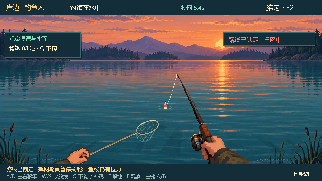
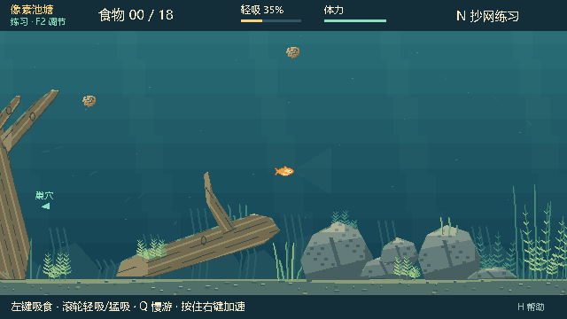

# 吃饵，不上钩 · BaitbreakPixel

一个 2D 像素风格的人鱼对抗游戏：小鱼在水下觅食、缠线和逃脱，钓鱼人在岸边控竿、收放线与抄网。支持单机挑战、自由练习和一人对一鱼的局域网联机。

**当前源码：0.27.0（P5.0/P5.1 地图生成开发原型）** · Godot 4.7.2
**当前公开 Windows 试玩包：0.26.4**，历史发行记录继续保留。

用户已确认 0.25.2 社会线索试玩通过。0.25.3 让 NPC 真实误咬钩、自动挣扎、逃脱、断线或被拉起。钓错 NPC 不结束比赛；玩家可趁机吃饵、回巢，钓鱼人需要重新部署。NPC 捕获后暂离生态，延迟生成新 ID 的鱼。

Phase 4 已由用户人工确认；Phase 5 第一轮按[生成契约](docs/architecture/MAP-GENERATION-PROTOTYPE.md)推进。已完成 P5.0/P5.1 原型与 10,000 个种子验证；运行 `./Preview-Generated-Pond.ps1 -MapSeed 42` 查看独立开发预览，正常游戏仍使用经典池塘，Snapshot schema16 与 Map Contract v1 保持。

0.26.5 新增钓鱼人按住鼠标右键加速左右移竿：基础速度 90 px/s，加速 180 px/s，松开恢复；本地与联机一致。当前源码尚未发布新试玩包，公开包仍为 0.26.4。见[本次验证记录](docs/test-reports/ANGLER-MOVE-BOOST-0.26.5.md)。

用户授权连续完成 Phase 4 剩余开发与自行测试。本轮完成画面层 MapContext 迁移、通用地图依赖清理和测试专用地图，保持玩家仍使用原 pond_v2；快照 schema16、严格 MapRef 联机和角色隐私边界延续。详见[最终地图架构](docs/architecture/MAP-PRESENTATION-FINAL.md)与[最终验证和人工复测清单](docs/test-reports/PHASE04-MAP-FINAL-0.26.4.md)。0.26.4 Windows 试玩包已构建、验证并公开发布；解压后运行 BaitbreakPixel.exe，核对菜单 0.26.4。Phase 4 后续已由用户确认；Phase 5 当前仅开发原型，Watergen 合流与生成地图比赛入口留待后续。

玩家 10 px 自动咬食、0.80 秒间隔、4/6/8 容量和已确认的抢食/补饵规则保持。NPC 继续真实消耗食物、增加自身饱食，不增加玩家分数、不参与胜负。玩家原 QTE、缠线、松线、断线、张力和提鱼保持。

## 下载试玩

本版沿用 0.24.4 的渐变吸力，散粒实际移动、剥离和整饵位移目标共用同一距离场；此前[距离修正验证](docs/test-reports/PHASE02-DISTANCE-VALIDATION.md)保留为历史记录。

### 公开 Windows 试玩包：0.26.4

从 [v0.26.4 发行页](https://github.com/lljh2777-cyber/BaitbreakPixel/releases/tag/v0.26.4)下载 [BaitbreakPixel-0.26.4.zip](https://github.com/lljh2777-cyber/BaitbreakPixel/releases/download/v0.26.4/BaitbreakPixel-0.26.4.zip)，解压后运行 `BaitbreakPixel.exe`。EXE 与同目录 PCK 保持在一起，玩家无需安装 Godot。小鱼嘴边有食物时自动咬食，左键吸食；完整操作见包内说明。

截至 2026-10-04 已发布 **0.21.0–0.26.1 及 0.26.4，共 28 个 Release**，每版均附 ZIP 和 `SHA256SUMS.txt`。其他版本见 [全部 Releases](https://github.com/lljh2777-cyber/BaitbreakPixel/releases)，核对结果见 [0.26.4 发布记录](docs/test-reports/GITHUB-RELEASE-0.26.4.md)、[0.26.1 发布记录](docs/test-reports/GITHUB-RELEASE-0.26.1.md)、[0.26.0 发布记录](docs/test-reports/GITHUB-RELEASE-0.26.0.md)、[0.25.5 发布记录](docs/test-reports/GITHUB-RELEASE-0.25.5.md)、[0.25.4 发布记录](docs/test-reports/GITHUB-RELEASE-0.25.4.md)、[0.25.3 发布记录](docs/test-reports/GITHUB-RELEASE-0.25.3.md)、[0.25.2 发布记录](docs/test-reports/GITHUB-RELEASE-0.25.2.md)、[0.25.1 发布记录](docs/test-reports/GITHUB-RELEASE-0.25.1.md)、[0.25.0 发布记录](docs/test-reports/GITHUB-RELEASE-0.25.0.md)、[0.24.6 发布记录](docs/test-reports/GITHUB-RELEASE-0.24.6.md)、[0.24.5 发布记录](docs/test-reports/GITHUB-RELEASE-0.24.5.md)、[0.24.4 发布记录](docs/test-reports/GITHUB-RELEASE-0.24.4.md)、[0.24.3 发布记录](docs/test-reports/GITHUB-RELEASE-0.24.3.md)、[0.24.2 发布记录](docs/test-reports/GITHUB-RELEASE-0.24.2.md)及[此前 14 版发布记录](docs/test-reports/GITHUB-RELEASES-2026-10-02.md)。0.24.6 发行记录保留其发布当时的验证边界；用户随后已确认手感并允许进入 Phase 3。

### Phase 2.3：已由用户人工关闭

用户于 2026-10-03 确认目前手感合适并进入 Phase 3。此前各版的自动统计、未通过项与人工门记录保留原文，不能把后续确认回写为当时已通过。0.25.0 环境鱼、0.25.1 抢食和 0.25.2 社会线索均已由用户试玩确认；用户随后授权进入 P3.5；这不回写为对每一项 P3.4 手感的逐条验收。用户随后于 2026-10-04 明确通过 Phase 3；0.25.5 报告保留当时验证和人工门记录。

实现与统计定义见[摄食平衡边界](docs/architecture/PHASE02-FEEDING-BALANCE.md)。此前[三种饵型报告](docs/test-reports/PHASE02-BAIT-VALIDATION.md)与[P2.1 报告](docs/test-reports/PHASE02-BITE-VALIDATION.md)保留原始结果。

0.23.0 新增饱食度、可抵抗的本能偏移、基于可见线索的三档警惕，以及按饵生命周期随机决定的隐藏鱼钩。保持一条玩家鱼和现有主鱼竿，没有加入自动吸食、多鱼或长期记忆。实施与验收范围见 [Phase 0–1 检查记录](docs/architecture/PHASE-0-1.md)。当前版本尚需人工试玩确认控制手感与核心博弈，不能将自动统计当作“已经好玩”的证明。

0.22.6 基于 `96faf4d`，修复首次打开玩法方案页时因方案目录尚不存在而产生的引擎错误；同时维护测试入口、截图产物路径和文档，并排除未引用的调色着色器。检查环境与范围见 [2026-10-02 维护报告](docs/test-reports/TEST-INFRASTRUCTURE-MAINTENANCE-2026-10-02.md)，不能将原始 0.22.5 的 Windows 检查结果当成本次改动的验证。

- 0.21：扩大水域、跟随镜头、完善草木石环境；鱼视角隐藏钩体、吊线及饵料身份，钩饵与散饵整团共用吸动响应
- 0.22.0–0.22.1：轻吸剥外层、猛吸快速拉近，增加拉伸、流线与入口反馈；吸食时默认以当前游动模式的 68% 游速移动
- 0.22.2–0.22.4：水体层次、自然树根巢穴、远中近景视差及木石体积明暗；相连主干、枝干和根系统一透明，连接处不重复混合
- 0.22.5：精简发行包并整理测试与打包工具，玩法、规则及画面与 0.22.4 相同

逐版记录见 [开发历史](docs/history/CHANGELOG.md)，包体校验来源和后续维护约定见 [版本与包索引说明](docs/history/RELEASES.md)。当前源码的完整操作见 [试玩说明](docs/gameplay/PLAY.txt)，双人连接方法见 [联机指南](docs/gameplay/NETWORK.md)。

## 游戏画面

| 钓鱼人：岸边第一人称 | 小鱼：水下侧视 |
| --- | --- |
|  |  |

## 基本操作

| 角色 | 操作 |
| --- | --- |
| 小鱼 | WASD 游动，鼠标朝向；左键吸食，嘴边自动咬食，滚轮调吸力，右键持续冲刺；空格进行 QTE 和主动缠线；满足目标后按 E 回巢 |
| 钓鱼人 | A/D 左右移竿，按住右键以 2 倍速度移竿，W/S 收放线，Q 下钩或补饵；F 尝试解缠，空格进行 QTE；E 进入水下观察，左键依次选择抄网起点 A、终点 B |
| 通用 | H 查看帮助，Esc 打开菜单，F2 / F3 调整玩法规则，F11 全屏 |

鱼需要权衡食物、体力、张力与逃脱时机；钓鱼人可以拉鱼出水，也能主动抄网。体力、断线时间、QTE 时长等玩法数值可在设置中调整、保存和分享方案。联机由房主提供本局规则。

目前为单池塘 MVP，联机支持一人对一鱼；尚无互联网大厅、多鱼多人或更多地图。

## 开发运行

1. 克隆仓库，用 **Godot 4.7.2** 导入根目录的 `project.godot`。
2. 按 **F5** 运行项目。
3. Windows 打包使用根目录的脚本，指定已安装的 Godot 目录：

```powershell
.\Build-Pixel.ps1 -GodotDirectory 'D:\Tools\Godot_v4.7.2-stable_win64.exe'
```

该目录需要同时包含 `Godot_v4.7.2-stable_win64.exe` 和 `Godot_v4.7.2-stable_win64_console.exe`。默认输出到相邻 `Releases/BaitbreakPixel-0.27.0` 目录及 ZIP；也可用 `-OutputDirectory` 指定位置。

当前测试入口、套件状态和产物目录配置见 [测试运行指南](tests/README.md)。核心抄网逻辑检查示例（替换为本机引擎路径）：

```powershell
& 'D:\Tools\Godot_v4.7.2-stable_win64.exe\Godot_v4.7.2-stable_win64_console.exe' --headless --path . --script res://tests/net_v021.gd -- --test-profile
```

测试使用独立配置；带原生画面截图的脚本需要图形窗口，不使用 `--headless`。本次检查见 [0.26.4 地图抽象最终报告](docs/test-reports/PHASE04-MAP-FINAL-0.26.4.md)；此前 Windows 试玩包的验证保留在 [0.22.5 原始报告](docs/test-reports/TEST-REPORT-0.22.5.md)。

## 项目结构与文档

- `scripts/`：游戏模拟、输入、AI、显示与联机。
- `scenes/`、`assets/`：场景和素材；素材制作记录与素材放在一起。
- `tests/`、`tools/`：回归检查与开发工具。
- [`docs/`](docs/README.md)：[架构](docs/architecture/)、[玩法](docs/gameplay/)、[测试报告](docs/test-reports/README.md)、[开发历史](docs/history/CHANGELOG.md)。
- [`history/releases.json`](history/releases.json)：42 个历史恢复包及 0.21 起本地试玩包的分区索引；字段与来源见 [索引说明](docs/history/RELEASES.md)，历史标签的恢复范围见 [历史恢复说明](docs/history/HISTORY-RECOVERY.md)。

`.godot/` 缓存、`artifacts/` 测试产物和游戏发行包不纳入源码仓库。旧版可运行包保存在 [Releases](https://github.com/lljh2777-cyber/BaitbreakPixel/releases)。
