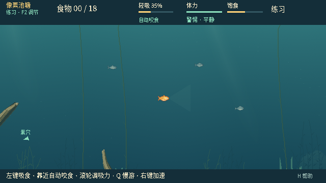
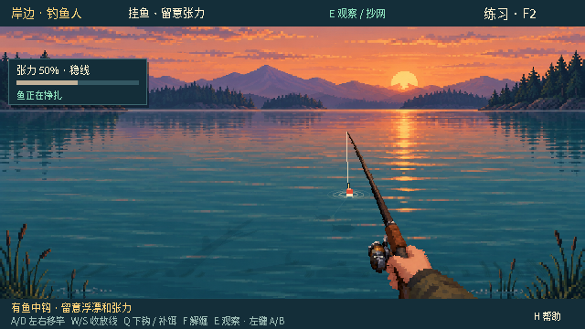

# 0.26.1 · P4.2 Authority MapContext 验证

## 结论与停止点

用户于 2026-10-04 确认 0.26.0“测试通过，继续”。本轮按新规格 §79 仅完成 **P4.2 Authority Context**：World 在实体初始化前获得已验证、每局冻结的地图；玩家/NPC 出生与移动、回巢、饵位、抄网、交互目标/线圈、钓鱼人边界、AI 和 Authority 食物感知读取 MapContext。

原 pond_v2 的完整状态、RNG、观察和画面对照保持等价。没有随机地图、选择 UI、新美术、Watergen 合并、多竿、鱼记忆、QTE/Hook/自动咬食调参。**schema15 / 网络结构 / Presentation 尚未迁移**；完成后停在 P4.2，等待人工抽查，再进入 P4.3。只提交推送；未构建包、ZIP 或 Release，公开 Windows 包仍为 0.26.0。

架构与 API、残留边界见 [MapContext 说明](../architecture/MAP-AUTHORITY-CONTEXT.md)。历史 P4.1 报告和发行记录保留原文，不回写旧门的状态。

## 基线与源代码锁

- 最新实际远端基线：`0a3e5af3dc3ca26f0909644505ff24a1de1fe06d`，0.26.0
- Tree：`3bc012c3e84f2ad79872757c7d574c3a0234dab1`
- git archive SHA-256：`6635f95a7cb5282c5560e9cef3c1b9c5400675c6d45e0f322f0cbe7d6d8b5737`
- 包含用户新发布的 0.26.0 Windows 文档、Python 3.11 基线解包修正与 AGENTS 指引，未用较旧 9f91639 覆盖这些并行成果
- 在运行时改动前从已提交 Git tree 冻结，原 138 个 runtime 文件逐项锁定；其中 126 个不变、8 个经过逐文件审查的 Authority consumer 变化、4 个仅精确版本标记变化，另新增 Context/Geometry 与两个 UID
- MapDefinition、Validator、Registry、pond_v2 原始数据/hash、Snapshot、网络投影/会话、Rope 算法、Presentation 和素材均按原字节保留；network_protocol 仅 exact BUILD 更新
- 旧 P4.0 外部 harness、旧对照工具、旧锁与 net-batch 诊断原样保留。新的独立 driver 使用旧程序作为基线，不从新 Context 反推“旧实现”

[源码契约与审查哈希](data/map-authority-0261/runtime-contract.json) · [完整等价结果与源指纹](data/map-authority-0261/baseline-equivalence.json) · [复现步骤](../../tests/fixtures/phase04/authority_README.md)

## 实施与不同地图证明

1. MapContext checked factories 在返回实例前验证。public scalar 不可替换；嵌套 collection、PackedArray 和查询记录均为 detached exports。私有几何/bounds/ID/capability caches 编译一次，World 仅在安装地图时取出并缓存，不在每 tick 复制全部几何或重新 hash
2. `reset_world(config, definition=null)` 返回 bool。坏类型、未知 map/revision、非法 definition 或错误 hash 在任何实体/回合/RNG 变化前拒绝；只有 `map_errors` 更新。成功的完整重开同时替换 World 与 rig context，并重建所有派生缓存
3. 保留 40 target 原顺序与兼容 index：18 木石、22 草目标；三个移动/观察 GRASS 区仍独立。net/spawn/occlusion/contact-fade/rope-anchor 分别读取显式能力。修正审查中发现的草目标共享 fade_group_id 遗漏，并新增跨 kind 分组回归；原 pond 自组草字段保持原样
4. NPC 三个生成区以水域相对比例推导，乘除顺序保证 pond 原整数边缘和候选坐标精确恢复；仍用独立 NPC RNG，原排除/尝试/ID 规则保持
5. 测试专用 `authority_fixture` 为 **800×380**，water 从 `(110,92)` 到 `(760,350)`，floor354；使用不同 spawn/home/sites、五个交互目标和独立能力组合。验证所有八个修改 consumer 的实际入口，包括左右上下夹取、NPC spawn/Hook/landing、感知食物、AI、草减速、net 阻挡/可见性、回巢、fade 与 coil。fixture 不注册、不显示、不打包
6. Cosmetic-only 改动下连续 120 tick 的 Authority、RNG 和观察一致；直接输入修改和导出 packed 数组修改不能污染活动 Context 或 World 的初始缓存

`fish_passable=false` 没有被扩展为新碰撞玩法。旧 Rope 路由节点边界 `9/631/309` 保留，通用任意尺寸的绕障提网路线尚未获证；schema15 持久化/网络与旧画面也只支持 pond_v2。不同地图 fixture 证明的是本轮迁移路径，不能当作后续地图完整可玩性、网络兼容或渲染支持。

## 正式验证结果

Linux x86_64，**Godot 4.7.2.stable.official.ed1daf0bf**，Dummy 音频。引擎执行文件 SHA-256：`8d106cbe6144c2dc7e881d61d2429c1a8a76e6b22ef48bd5e48dcf934953f71e`。原生验证使用 cloud desktop 的 X11/OpenGL 实际图形窗口；未把 headless 当作 native。

| 门 | 结果 |
| --- | --- |
| 官方编辑器导入 | 通过 |
| Current headless，正式注册表完整覆盖，架构门单独复跑 | **66 套，254,835 断言，0 失败** |
| MapContext / 几何独立等价与不可变性 | 2,626 断言，0 失败 |
| 不同尺寸 Authority fixture | 1,017 断言，0 失败 |
| Architecture 原断言与派生缓存覆盖 | 60 断言，0 失败 |
| Python runner / provenance / analysis | **231 项，0 失败**，包括 20 项新增对照防护 |
| Current native | **22 套，801 断言 + 2 完成标记，0 失败** |
| 独立旧版 vs 新 Context 模拟 | **8 场景，2,100 input ticks/侧，86 checkpoints/侧，零差异** |
| 同条件完整 RGBA 对照 | **106 对帧，106 完全一致，0 不同像素** |
| 冻结/当前 source、review hashes 与同一 engine | 前后稳定，全部通过 |

[正式注册表逐套结果、重跑记录与最终源哈希](data/map-authority-0261/regression.json)

注册表共 128 个顶层入口；只对 current profile 宣称通过。没有用 globs 混入 historical/manual/retired，也未把历史红项计为绿项。现有实际 ENet 套件完成两种角色、玩家与 NPC Hook、普通分步抄网、规则和恢复检查；独立模拟中的 wire 比较没有冒充真实传输。

### 首轮架构检查失败及修正

首次 current 全量运行的 `architecture_v020` 为 45/1：旧“每个 script variable 都应进入 Snapshot”的枚举不认识新静态 map caches、map 引用、HOME 只读别名和拒绝诊断。未修改 Snapshot，也未用“所有下划线字段/Object 都排除”的宽泛规则。

测试现在精确列出这些字段，保留原 46 条检查，新增 14 条证明：字段确实由当前地图派生、独立 pond golden 边界正确、每 tick 不重建/变更、schema15 restore 不改变缓存、拒绝诊断不改变 Authority、重开能从被损坏的 detached 缓存重建；未知 underscore/Object/cache 字段依旧使架构门失败。定向重跑 60/0；汇总以这份最终结果替换旧失败行，同时保留首次失败证据。其余 65 current headless 套件均在同一未变化 runtime 下通过。

## 模拟等价范围

原外部 harness 保持八个确定性场景：双规则/NPC 密度游动、真实玩家/NPC 摄入和重挂饵、玩家嘴部接触与警告期输入、QTE/缠线、NPC 接触/连续收近/提鱼/捕获/延迟新 ID、分 tick 抄网捕获玩家及不捕获 NPC。

每 tick 完整 Authority Variant bytes 累入哈希；检查点比较精确主 RNG 整数字符串、snapshot、FishObservation visual/decision、NPC social/private state、bait、Hook/QTE/wrap、net、stats、两角色 wire 与压缩 Authority。恢复、暂停冻结、第二半程 replay 亦保持。每侧报告记录 1,690 个内部断言，写入结果后控制台 1,691；不把两种统计混淆。

部分场景继续使用原来的受控位置/补饵时刻/QTE 绿区白盒干预。这是旧/新等价见证，不是无人辅助通关或平衡胜率。没有重新运行 1,200 场 P3.5 留出矩阵；本次保留现有生态/供给/策略/摄食回归，未把历史统计冒领为本轮实验。

## 原生像素门与鼠标干扰

四个完整套件 `phase03_npc_native`、`phase03_npc_hook_native`、`wood_fade_native`、`net_native_v020` 在同一引擎下生成 106 张命名帧/侧，涵盖鱼/岸边/观察、HUD、NPC、食物、Hook、草木淡出、线和网。原套件每侧 229 条断言保留。

- 初次直接比较“旧四套”与“当前完整 22 套”的捕获，82/106 相同、24 帧共 5,376 像素不同；差异全是观察视角的现场鼠标 A 标记。当前完整顺序中更早的 net 测试会 `Input.warp_mouse`，旧四套先运行 NPC，故输入前提不同
- 第二次仅统一顺序和离屏窗口仍因 Linux 窗口管理器/鼠标夹取产生位置不同，仍失败。两个失败结果均保留，未降阈值、遮罩、裁剪或放宽原断言：[首次](data/map-authority-0261/native-initial-cursor-mismatch.json)、[离屏尝试](data/map-authority-0261/native-offscreen-cursor-mismatch.json)
- 最终在两侧使用**完全相同的外部 subclass setup**，每次调用未改原 render 前统一非交互鼠标区域、等一帧并读回。每侧 141 次 setup（83 + 58）记录完全一致，全部非交互，且前后完整 Authority bytes 不变。原图片按完整 RGBA 比较：106/106 相同、零差异

[逐帧哈希、鼠标 setup 证据和最终结果](data/map-authority-0261/native-pixels.json) · [可复现 setup 模板](../../tests/fixtures/phase04/authority_native_cursor_fixture.gd.txt)

| 当前鱼视角 | 当前岸边 NPC 中钩视角 |
| --- | --- |
|  |  |

## 性能与未覆盖范围

Context 的 validation/hash/targets/bounds 在初始化完成；主循环重用缓存。官方引擎本机诊断：100 次 validated Context load 合计 1.163 秒；10,000 轮 × 三项 cached query 合计 9.711 毫秒。仅为当前共享环境的短测，不是长期 FPS 或跨机器性能承诺。[原始记录](data/map-authority-0261/context-performance.json) · [探针](data/map-authority-0261/context-performance.gd.txt)

未构建或验证 Windows 新包、未做第二台物理设备或公网链路、未验证真实声卡、未替代本轮人工手感确认。项目/menu/log/exact build/未来默认构建目录统一为 0.26.1；公开发行索引仍为已发布的 0.26.0。

## 保留的旧联机边界问题

同一 tick 批次同时提交“打开观察 + 网起点 + 网终点”，`net_action.age` 保持 int0，旧 fish wire 的严格 float guard 拒绝。冻结 0.26.0 和新 0.26.1 的同一诊断结果完全一致；普通分成三个输入 tick 的流程通过。该缺陷没有修复，没有放宽网络守卫，也没有将异常投影计作正常 gameplay 通过。[完整诊断](data/map-authority-0261/inherited-net-batch.json)

## 人工抽查与下一步

同步 `feature/dev`，用 Godot 4.7.2 打开源码，核对菜单 0.26.1。本轮没有新包。

1. 鱼出生/回巢、三类饵与 NPC 抢食/误咬钩，节奏应与 0.26.0 一样
2. 玩家上钩/QTE/缠线、长按/暂停恢复、钓鱼人 W/S、分步抄网应无变化
3. 鱼/岸边/观察视角，以及两端同版互换角色复测

确认后才进入 **P4.3 Snapshot schema16 / map_ref / 网络地图握手**。当前通过不表示 Phase 4 整体完成。
