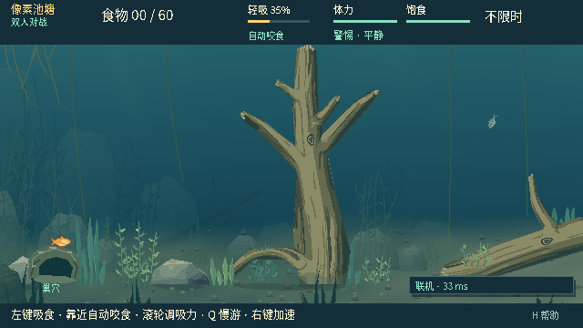
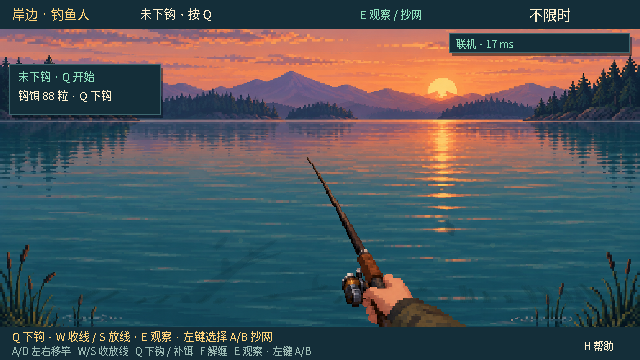
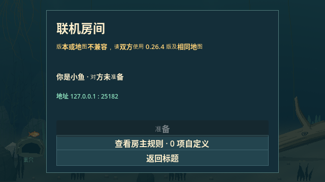
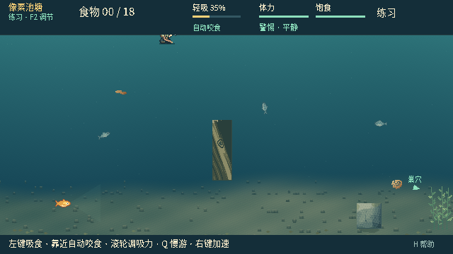

# 0.26.4 · Phase 4 地图抽象最终验证

## 完成范围

用户授权连续完成 P4，不再在 P4.4/P4.5 之间等待人工确认。本轮覆盖 **P4.4 Presentation Migration、P4.5 Hardcode Elimination、P4.6 Final Equivalence**，只提交推送源码、测试及证据，不构建游戏包或 Release。此前阶段报告保留当时的门状态；当前人工手感未代验，也未自动进入 Phase 5。

实际基线为开始前核对远端/本地一致的 `7efe59b5974a0da0042600c5817e66b3c2d23616`，tree `3f4d8ddda4f72d4bdf1d6c1fce435ccbfdcef66a`，版本0.26.2。它包含此前P4.3所有修正。使用该提交原样 Git archive 冻结；没有用新代码模拟旧版本。

## 代码结果

1. PondView、camera、shore、scenery、water/depth/wood/pixel art、显示用线/草/鱼绕圈和抄网投影统一读取当前显示世界的 MapContext
2. 新 MapPresentation 以 context 身份缓存只读几何和视觉映射，按稳定 presentation_ref/target_index 解析；同图重开复用纹理，不在每帧重建多边形或地图 hash
3. 通用模拟、网络和显示脚本不再导入 PondLayout；NPC验证、输入clamp、鱼端食物线索均显式使用当前/已验证地图
4. 路径节点窗口也显式参数化，并加入缓存身份。保留原pond西侧/浅水的历史路由策略，不借抽象扩大原地图路径；平移fixture证明可使用超出原631/309位置的合法节点
5. 测试专用800×360、320×240、较高及平移地图暴露不同水域/地板/HOME/SPAWN/饵位/目标数量假设。Fixture不注册、不进入发行包、不增加玩家地图入口
6. 修复继承的同tick“观察toggle+A+B”导致net age为int0、鱼wire严格float校验拒绝的问题；仅生产端改为0.0，严格校验、字段白名单、地图预检和权威原子恢复不放宽

完整架构与边界见[最终地图契约](../architecture/MAP-PRESENTATION-FINAL.md)。pond_v2 revision1/contract1和权威地图content_hash不变；authority/angler schema16、fish schema2不变，exact network build为0.26.4。

## 自动验证结果

| 验证门 | 最终结果 |
| --- | --- |
| 注册表current无窗口 | **72/72套，271,656断言，零失败**；plant_art初始化修正后独立替换其原timeout行 |
| Python工具/对照器/产物契约 | **270/270通过** |
| current真实原生 | **23/23套，845断言+2完成标记**；另有editor import通过 |
| 严格MapRef/真实ENet专项 | **276/0**，包含在无窗口总数中，不重复累计 |
| Main场景真实原生联机UI | **44/0，12张截图**，单列补充 |
| 新800×360 fixture | **122/0**，含路由窗口/缓存隔离；计入无窗口总数 |
| 画面/镜头缓存及独立投影黄金门 | **442/0 + 3,036/0**，计入无窗口总数 |
| 完整状态旧/新对照 | **8场景、2,100tick/侧、86检查点/侧，零字节差异**；各侧3,792项检查含写出 |
| 固定条件完整RGBA | **106/106完全相同，零不同像素**；每侧229断言、141游标不变性设置 |
| 全部原生旧/新命名图片 | **319/320完全相同**；唯一差异为标题版本caption的698像素，范围[363,282,475,294] |
| 原生新增fixture | **44/0，9张截图**；计入23套总数，不重复累计 |
| 原4,000供给结构场景 | **4,000/4,000满足原24项聚合不变量+1写出检查**，计入无窗口总数 |

[逐套回归与修正过程](data/map-final-0264/regression.json) · [供给门配置摘要](data/map-final-0264/supply.json) · [原生、逐帧与源码证据](data/map-final-0264/native.json)

注册表共136个顶层入口，只声明current通过。standalone直接字节门运行两个相同seed/input实例并核对独立复现；外部两构建比较各single-pass报告内3,791项，加写出后3,792项。原生完成标记和补充UI断言不伪装成注册表套件数量。最终headless运行时代码/素材不变；后续仅改plant_art测试初始化的一行及新shore测试末尾空行；所有运行时及其他源码直接字节核对不变，分别完整复跑16,579和3,036断言。GitHub若无checks/runs/statuses则不称CI通过。

## 等价方法与范围

[完整直接字节对照](data/map-final-0264/equivalence.json)使用同一外部harness分别运行冻结旧源码和当前源码，保留P4.0的8个原始场景、seed、setup、command和intervention函数。每侧2,100个实际输入tick、86个检查点，比较：

- 每tick完整authority snapshot，包括map/schema信封、state、rig和RNG
- 完整FishObservation、决策观察、NPC观察和NPC状态
- Bait补给/消耗、Hook/QTE/wrap、抄网、统计和双方public wire
- capture→restore→capture及中点恢复后的后半程replay

本轮两边同为schema16，因此 **没有任何metadata排除、字段裁剪、排序、取整或数值容差**。证据保留按tick分帧的原始Variant字节，gzip只用于本地存储；摘要定位具体tick和子系统，未建立大批无意义SHA256源文件/图像清单。源码身份使用必要Git commit/tree与直接源字节核对；发布校验只验证所提交Git对象完整性。

场景包含受控位置和QTE时刻等明确白盒设置，证明抽象兼容，不声称无人辅助通关或重新获得生态胜率结论。现行NPC/Phase1–3玩法、真实ENet和4,000供给结构场景另行执行；没有重跑P3.5的1,200场策略留出矩阵。

## 原生画面与测试地图

使用云电脑真实X11/OpenGL窗口、官方Godot4.7.2、Dummy音频。完整RGBA比较不遮罩、不裁剪、不设像素容差；鼠标控制沿用既有非交互区fixture，每次核对完整authority不变。新增Main场景fixture实测画面尺寸、当前地图缓存、shore往返、真实抄网观察/路线推进，以及pond→fixture→pond全部像素恢复。它只展示测试几何，不表示新增可玩的地图。

原生UI补充覆盖两个加入角色、本机公共几何、地图验证前Ready禁用、正常进入对局，以及错误MapRef在加入方明确可读的拒绝提示。

[逐套原生、全帧RGBA、游标与源码证据](data/map-final-0264/native.json)

| 原pond鱼客户端 | 原pond钓鱼人客户端 |
| --- | --- |
|  |  |

| 地图不匹配明确拒绝 | 仅用于测试的800×360地图 |
| --- | --- |
|  |  |

## 单独记录的修正与历史红项

[同tick抄网前后原始诊断](data/map-final-0264/net-batch-correction.json)：冻结版同tick输入产生int0，fish wire拒绝；当前全部检查点为float0.0且fish wire可接收。普通分三个tick输入的结果JSON完全相同。新回归同时注入非法int0，要求仍在变更世界前拒绝。此项是明确修复，不把异常旧/新接受结果包装为等价。

`untangle_v020` 为注册表已列历史诊断：冻结7efe59b与本轮均43通过/1失败，仍为旧“多圈保持张力”断言；没有降低断言或把它计入current。现行替代为untangle_v021。historical/retired/manual不混入当前通过总数。

最初完整回归因后续Rope缺项修正被主动中止并保留日志；最初native23虽全部通过，但运行期间新测试输出目录helper发生变化，源码稳定门正确拒绝该次作为最终证据。原生正式结果使用最后稳定源码的完整重跑。无窗口完整门另发现plant_art旧测试直接调用内部光栅helper前未安装地图；仅补显式测试地图初始化，原全部断言保留，并独立复跑该套件。最终汇总用其复跑结果替换原timeout行，同时保留失败记录和源码差异核对；其余运行时代码及套件源码不变，禁止把重复运行叠加成更大通过数。

## 人工复测清单与未覆盖

同步feature/dev，以Godot4.7.2运行源码并核对菜单0.26.4：

1. 玩家原位置出生，吃够回巢；三类饵、吸/自动咬和补饵
2. NPC抢食、社会线索、误咬钩、拉起/延迟新ID；玩家可继续觅食
3. 玩家钩入口、QTE、缠线/解缠/脱钩；钓鱼人收放线和抄网
4. 鱼视角、岸边投影、HUD、草木透明和线网观感与之前一致
5. 双端同版互换角色，创建/加入/准备/重开/断线重连

自动验证不代替用户手感确认。未构建或执行本版Windows发行包，未验证第二台物理设备、公网链路或真实声卡。公开Windows试玩包仍为用户已发布的0.26.1；本轮没有新下载附件、Release或历史包清理。
