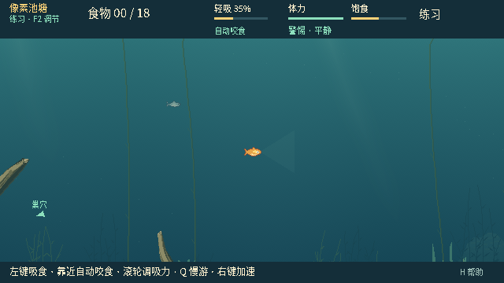

# 0.26.0 · P4.0 + P4.1 地图数据基础验证

## 结论与阶段边界

用户于 2026-10-04 明确确认“P3通过，开始下一阶段”。本轮按新规格 §79 / §88，**仅执行 P4.0 + P4.1**：冻结基线、完整依赖审计、MapDefinition contract1、独立 pond_v2 数据、canonical SHA-256、Validator、Registry 与等价验证。

当前游戏继续使用原 PondLayout。没有 World / MapContext 迁移，没有 schema16 / map_ref 握手，没有画面或玩法变化，没有随机几何、Watergen 合并、地图菜单、多竿或鱼记忆。只更新 0.26.0 项目/菜单/日志/exact-build 标记及默认未来打包目录。本次没有生成包或 Release，公开 Windows 0.25.5 及用户已有发布记录保留。

**完成后 STOP：P4.2 Authority MapContext 尚未开始。** 当前通过的是未接入运行时的数据基础门，不是 Phase 4 最终整体迁移或最终人工验收。

## 基线与可追溯性

- 实际从远端同步最新 `feature/dev`：`9d11fe8ae4bb7a49abe5fcd0e6f518ed0ebd3a92`
- Tree：`377f935c054e6204d0b84075ef7b69cb72b5d6e1`
- 版本：0.25.5；包含 `f2a6216` Windows fingerprint 路径修正、合并与公开 0.25.5 发布文档
- 之前自动验证祖先 `7fc99f6` 保留，但未把旧祖先误当最新源码
- `git archive` 冻结全部 977 个 tracked 文件；锁文件、archive SHA 和运行时文件 SHA 随测试保存，禁止从新模型回写“旧基线”
- 130 个原运行时文件中 126 个逐字节相同；4 个仅有精确允许的版本字符串变化。Snapshot、World、NPC、Rope、Net、FishObservation、network session/projections 逐字节相同
- 当前新增 runtime 源仅允许位于 `scripts/maps/`；旧 consumer 新增 import 也会令 baseline driver 拒绝

[独立基线/场景与源码锁证据](data/map-foundation-0260/baseline-equivalence.json) · [复现工具与限制](../../tests/fixtures/phase04/README.md)

## 实施内容

1. [完整依赖审计](../architecture/MAP-DEPENDENCY-AUDIT.md)：58 文件 / 211 符号匹配行，67 文件 / 266 数字匹配行；区分 Authority、Network、Snapshot、Presentation、Tests、Tools、Docs，列出全部命中文件/行及误报。还核查间接引用、NPC spawn regions、旧 rope node bounds、camera clamp
2. [数据契约](../architecture/MAP-DEFINITION-CONTRACT.md)：独立 value-only built-in definition；18 木石、22 草目标、6 饵位、3 个独立 GRASS 移动/观察区域及原视觉 metadata 完整保留
3. 显式稳定 feature ID 和过渡 compatibility index；旧 target 顺序、fade groups、polygon 顶点顺序、coils 均保持
4. canonical 使用固定字段顺序、语义数组顺序、little-endian IEEE-754 精确数值编码；不依赖 Dictionary 迭代、Object identity、locale 或浮点四舍五入
5. Validator 严格字段/类型、有限值、bounds/anchors/sites、polygon 自交/面积/零边、ID/引用/hash、深度/体积与循环/对象拒绝；current mode 最少 **4** 生命周期槽，pond 自身仍保留 **6** 候选点
6. Registry 只注册 pond_v2 revision1，验证成功才返回深层 detached 值；不注册测试 fixture，不初始化世界，不消耗 RNG

固定 hash：`794aea6774b6a6626a1f56a58a1e0db0811c30eb60ac35eb9c2f472788fa5ef4`。该值已作为 golden 固定在测试中；相同数据在不同进程和 Dictionary 插入顺序下相同。视觉种子/profile/appearance 不改变 Authority hash；GRASS、几何、feature identity/order/capabilities 会改变。

独立审查纠正了一个作者数量与玩法最低数量的混淆：最少饵位应为当前四槽，不是 pond 的六个候选点。已加入 3 拒绝、4/5/6 接受的明确用例，旧 pond 数据未改。

## 验证环境与结果

正式测试：Linux x86_64，**Godot 4.7.2.stable.official.ed1daf0bf**，Dummy 音频。原生测试使用实际 cloud desktop X11/OpenGL 图形窗口，非 headless 冒充 native。官方引擎压缩包 SHA-256 `cadd3204e728a35d3f13adb7fd0d7902636b79f6b95c40c265eb73b6c35329e4` 与[官方资产页](https://github.com/godotengine/godot-builds/releases/expanded_assets/4.7.2-stable)一致；执行文件 SHA-256 `8d106cbe6144c2dc7e881d61d2429c1a8a76e6b22ef48bd5e48dcf934953f71e`。

| 门 | 结果 |
| --- | --- |
| 官方引擎导入 | 通过 |
| Current headless（分批完整覆盖） | 64 套件，251,178 断言，0 失败 |
| 新 map definition | 808 断言，0 失败 |
| 新 map validator | 1,863 断言，0 失败 |
| 新 baseline standalone | 3,388 断言，0 失败 |
| Python runner / analysis / provenance | 209 项通过，0 失败 |
| Current native | 22 套件，801 断言 + 2 完成标记，0 失败 |
| 冻结基线 vs 当前模拟 | 8 场景 × 每侧 2,100 input ticks，86 checkpoints / 侧，零差异 |
| 原生逐像素对照 | 4 套件、106 帧，decoded RGBA 完全相同，零差异 |
| Runtime/source guards | Snapshot schema15、RNG、观察/hidden truth、角色投影等保持；source 稳定 |

正式注册表含 126 个顶层入口；只对 current profile 宣称通过，未用历史 globs，也未把 historical/manual/retired 的历史红项当绿项。Assertion 数与无计数的完成标记分开报告。[汇总](data/map-foundation-0260/regression.json)

本轮没有重新执行 1,200 场 P3.5 留出平衡矩阵；玩法源码与参数逐字节锁定，执行当前生态集成、供给可达、RNG、snapshot、ENet、QTE/NPC 回归，并新增独立 8 场景精确比较。既有 P3.5 留出结果保留为历史证据，不重复冒领为本轮实验。

## 精确模拟比较覆盖与限制

八场景包括双规则/不同 NPC 数的游动、实际玩家/NPC 颗粒摄入与重挂饵、真实玩家上钩入口/警告按键、QTE/物理缠线、真实 NPC 嘴部中钩/连续收线/提鱼/捕获/延迟新 ID、分 tick 手动抄网玩家捕获及 NPC 不计捕获。

每 tick 将完整 Authority Variant bytes 累入 SHA-256。详细 checkpoints 比较主 RNG（保留整数精度）、snapshot、FishObservation visual/decision、NPC 社会观察/私有状态、bait、Hook/QTE/wrap、net、round stats、两角色 wire 和压缩 authority；并校验 restore/replay 与暂停冻结。相同 seed、input 和明确干预分别在旧源码归档与当前源码执行；不是两次调用新地图构造器。

部分场景使用受控几何/白盒 QTE 绿区年龄/固定补饵 tick，使需要的生命周期可重复到达。这是等价性见证，不是无辅助通关、平衡胜率或真人手感实验。baseline/current 直接 wire 比较不冒充 ENet；真实传输由既有注册网络套件单独覆盖。

## 视觉与性能边界

四个未修改的 native 套件在同一官方引擎/桌面分别运行：phase03_npc_native、phase03_npc_hook_native、wood_fade_native、net_native_v020。覆盖鱼、岸边、观察视角、HUD、NPC 抢食/社会线索/上钩/捕获/逃脱、草木淡出、线与网；106 张图片逐字节比较 decoded RGBA，不使用容差或掩码。标题版本文字是有意变化，不属于等价游戏帧。

[逐帧像素哈希与结果](data/map-foundation-0260/native-pixels.json)

| 当前鱼视角 | 当前岸边 NPC 中钩视角 |
| --- | --- |
|  |  |

Map loading/validation/hash 是新增离线 API，游戏 tick 不调用这些函数；本阶段没有每 tick 重算/分配地图。100 次 validated load 的墙钟诊断记录在测试汇总，只用于此环境观测，不宣称跨机器性能保证。未来 MapContext 缓存属于下一阶段。

## 已知继承问题，未纳入本轮修复

独立探针发现：同一 authority tick 的单个命令批次同时包含 **打开观察 + 网起点 + 网终点** 时，旧 net_action.age 留作 int0，现有鱼端严格 float guard 拒绝。冻结 0.25.5 与当前 0.26.0 同样复现，120 tick 观察窗内 fish valid/apply 为 false；Authority/angler 可恢复。分成三个普通输入 tick 则均为 float 并通过。

若鱼客户端实际收到该异常投影，network_session 会停止该回合。本次直接探针没有测量真实 ENet 发生频率，因此不能宣称是普遍正常游玩的故障。此问题独立保留，不改变/放宽 guard，不把异常行悄悄计作通过；需要后续单独修复授权。[诊断记录](data/map-foundation-0260/inherited-net-batch.json) · [复现脚本](../../tests/fixtures/phase04/net_batch_probe.gd)

## 本轮人工抽查与停止点

同步 feature/dev，使用 Godot 4.7.2 运行当前源码；本轮不提供新包。

1. 标题显示 0.26.0；进入鱼与钓鱼人视角，原池塘/HUD/岸边投影应相同
2. 鱼出生、摄食/回巢、NPC 抢食和误咬钩，节奏应与 0.25.5 一样
3. 玩家上钩/QTE/缠线、W/S、分步抄网操作、暂停/重开无退化
4. 双端同版 0.26.0 换角色，普通逐次抄网输入；不要把上述合成单 tick 批次诊断当已修复

本轮通过后再确认进入 **P4.2 Authority MapContext**。先冻结 round map/cache，再迁移 spawn/home/bait/net/targets 与 MapGeometry，并继续做真正旧 adapter vs 新 MapContext 的模拟/RNG/观察等价；本次尚未执行这些迁移。
