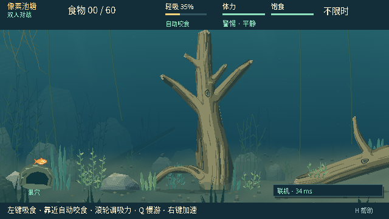
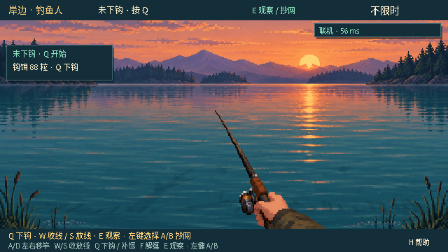
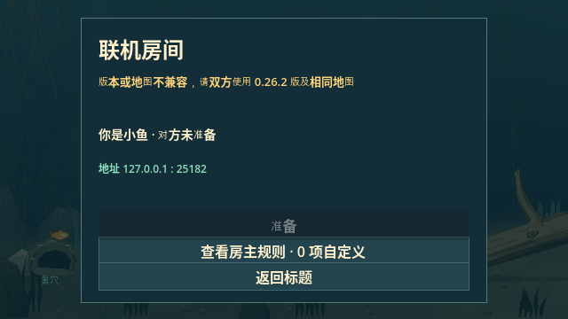

# 0.26.2 · P4.3 Snapshot / Network MapRef 验证

## 结论与停止点

用户确认 0.26.1“测试通过，继续”后，本轮仅执行规格 §79 的 **P4.3**：权威 Snapshot schema16、实际地图引用、本机解析恢复和联机地图握手。固定 `pond_v2` 的内容、主/NPC RNG、玩法、观察、钩/QTE/缠线、收放线及渲染保持。

没有随机地图、选择 UI、Watergen 合并、新美术、多竿或鱼记忆；**P4.4 Presentation Migration 未开始**。只提交推送源码/测试/说明，不生成游戏包、ZIP、Release 或标签；公开 Windows 试玩包仍为用户已发布的 **0.26.1**。完成后停在 P4.3 人工确认门。

[完整地图存档与联机契约](../architecture/MAP-SNAPSHOT-NETWORK.md)

## 基线与审查

- 刷新实际远端后基于 `8831f52ee7daae5d592282d5da432cbd67fccfb0`，tree `c90e98d2e07d20b5cf0c8742fba5818758813939`
- 这是用户的 0.26.1 Windows 发布文档提交；运行时与已验收的 `92b9010` 相同。保留用户的发布历史、包索引和新增 AGENTS 指引
- 改动前从该 Git commit 冻结基线；对照程序直接验证实际源字节与 Git archive，前后检查稳定，不用工作区重新生成“旧实现”
- `pond_v2_map`、MapDefinition hash/validator、MapGeometry、Rope 算法、QTE/摄食/钩逻辑、表现层与素材不改；项目/menu/log 只更新精确版本标记
- NPC 私有/公开 record validator 新增水域参数，默认值及原 pond 的 landing y39 边界保持；state 验证使用正在恢复的地图，而不是接收世界原来的 fixture
- 独立审查读取 runtime 实际 diff；比较器路径白名单仅限定范围，不冒充代码审查
- 遵照 AGENTS，不添加冗余全仓 SHA256 清单；只保留地图契约、确定性状态等价和发布对象验证所需的校验

历史 P4.0 harness、P4.1/P4.2 对照工具与原报告保留字节，不回写为 schema16。当原 `phase04_map_baseline` 不再适用于新 schema 时，显式标记 historical，当前使用带严格身份校验的新等价 harness；原八场景的 setup、commands、intervention 完全相同。

## 实现与兼容策略

1. Snapshot 顶层用 `map_ref` 取代 `map_id`，包含 `id/revision/contract_version/content_hash`，capture 读取实际 `world.map_context`。未注册测试 fixture 可以明确捕获自身身份，但无法冒充 pond 被持久化/网络接受
2. 恢复先校验 schema16 和完整 MapRef，再从本机 Registry 解析 Authority 地图，随后验证全部 state/rig；完全通过后才一次安装地图和赋值。错误引用或晚段状态错误不改变 World/rig/RNG/地图/缓存/诊断，不触发音效、胜负或档案事件
3. 同图恢复保留已有 Context/cache 引用；fixture→pond 的合法恢复同时更新 World 与 rig 几何缓存。地图解析与校验零 gameplay RNG；重复网络引用复用经过验证的只读 Context，不每 tick 重建 polygons 或 hash
4. **旧 schema15 及更早快照明确拒绝，没有迁移器**；不猜旧 map_id 的 revision/hash，不静默使用默认地图。state 中原有 legacy `net_aim` 仍精确 roundtrip
5. exact-build 为0.26.2；hello/welcome/start/start_ack 验证相同 MapRef。地图验证前的 ready/start/input/state/chunk/effects 不推进比赛；后续状态与会话引用也须一致
6. 鱼端独立 public schema2、钓鱼人 public schema16，既有 bait/NPC guards 分别保持1/2和3/4。只传引用，不发整个地图；隐藏鱼钩、随机种子、NPC 脑/私有统计的原裁剪边界不扩大
7. 恶意字段类型、缺失/额外字段、未知地图、错误 revision/contract/hash、非有限值、循环/过深值树、Object/Callable 与 Object/script-typed 容器在赋值前拒绝；typed-array 赋值也先验证，避免半途失败

### 独立发现并修正的接收包标量校验次序

审查触及的状态接收路径发现一个继承问题：`countdown={}` 时，原代码先应用合法 snapshot，鱼位置已从 `(66,385)` 变成 `(777,220)`、received seq 从-1变成1，随后在 `float({})` 报错。

本轮以独立复现确认后，只增加接收包 **ack 为非负 int、countdown 为有限 numeric 且在0..3** 的前置校验，放在任何世界/序号/渲染应用前。新用例覆盖两种角色的错误类型、缺失、负值、越界与非有限值，并验证合法整数/浮点0、3仍接受。没有放宽已有规则、float guard或变更有效包行为。失败停止会话时允许设置既有 `match_paused`，其余 Authority、序号、渲染保持原值。

这是本轮额外的有限接收边界修正，不宣称完成全网络协议安全审计。Variant 解码仍使用既有 Objects-disabled 路径，不能把解码后的容器校验扩写为对引擎解码器的完整安全证明。

### 原生发现的拒绝原因丢失

实际 Main 场景的双端验证发现，本轮初版 host 在发送 mismatch reject 后立即关闭 ENet，加入方偶尔只看到“连接已关闭”，而房主已明确显示地图/版本不兼容。地图拒绝始终有效，双方均未进入对局。

最终改为 **最多1秒的有界可靠发送排空**：房主立即进入 failed、map未验证、准备清空，期间拒绝所有新hello和对局数据；对方断开或到期关闭传输，保留明确错误原因。两种角色、14个bad-hello版本/地图变体、沉默对端期限和实际原生caption均复测。没有放宽地图校验，也没有延后允许比赛的条件。

## 自动门结果

Linux x86_64，官方 **Godot 4.7.2.stable.official.ed1daf0bf**，Dummy 音频。

| 门 | 最终结果 |
| --- | --- |
| 编辑器导入 | 通过 |
| Formal current headless | **68套、260,467断言、0失败** |
| Snapshot/MapRef 专项 | **295/0**，包含在current中 |
| MapRef/真实ENet/标量/拒绝排空专项 | **276/0**，包含在current中 |
| Python runner/provenance/analysis | **250项、0失败**，含19项新比较器防篡改检查 |
| Formal current native | **22套、801断言 + 2完成标记、0失败** |
| Main场景真实原生双角色联机UI | **44/0，12帧**，单列，不冒充注册表套件 |
| 冻结旧版→当前确定性对照 | **8场景、2,100ticks/侧、86checkpoints/侧，零玩法差异** |
| 固定同条件原生RGBA对照 | **106/106完全相同，零不同像素** |
| 完整native截图对照 | **319/320完全相同**；唯一差异为标题版本caption的859像素 |
| 既有供给门 | **4,000场景全部满足原24项聚合不变量 + 写出检查** |

注册表共131个顶层入口，只声明current通过。新快照等价standalone执行两遍，计8,449断言；外部旧/新每侧single-pass报告内4,221，加写出检查后控制台4,222。计数口径分开，native完成标记不当作断言。

[逐套结果与最终复跑记录](data/map-snapshot-network-0262/regression.json) · [确定性对照](data/map-snapshot-network-0262/equivalence.json) · [原生与逐帧对照](data/map-snapshot-network-0262/native.json)

完整current运行期间的最后两次改动只触及network_session接收/拒绝路径；最终额外复跑所有16个current Session/网络套件及architecture，共17套，并对这轮运行做完整前后源码字节稳定检查。结果逐套替换同名早期行，不累计重复断言。其他current套件的所执行代码未受这两次会话修正影响。

原生22套与106对像素门在标量前置修正后稳定通过；后续仅调整拒绝传输生命周期，最终实际Main ENet UI44项另行覆盖该路径。初次106对虽然像素相同，但期间有源码变动，明确保留为初次诊断；只把随后source-stable结果计入正式等价通过。

## 确定性对照范围

同一个外部 harness 在不可变0.26.1与新0.26.2运行：**8场景、每侧2,100输入 tick、每侧86 checkpoints**。逐 tick比较 state/rig/RNG，检查点比较玩家/NPC观察、食物与补给、Hook/QTE/wrap、net、统计与两角色公开投影。两侧各自还要求原样 snapshot capture→restore→capture 与后半程 replay字节完全相同。

跨版本仅排除事先验证的顶层 `schema` 与 `map_id/map_ref` 身份字段；鱼public1→2、authority/angler15→16逐项核对，mapref必须与同一 Registry相符。**没有递归字段裁剪、数值取整、排序或玩法数据归一化**。原始snapshot的变化是固定 **+168字节** 的新身份信封；不声称schema15原包与schema16原包字节相等。

场景仍保留历史受控位置/QTE时刻等白盒干预，证明兼容等价，不是无人辅助通关或新的生态平衡胜率。没有重跑1,200场P3.5留出矩阵；现行4,000供给场景和所有current生态门另外执行。

## 原生画面

使用云电脑实际 X11/OpenGL 窗口、Godot4.7.2、Dummy音频；不把 headless或Xvfb当成原生验证。固定106对同条件帧覆盖鱼/岸边/观察、HUD、NPC、食物、Hook、草木淡出、线与网；两边使用同一已有鼠标控制fixture，完整RGBA比较，不遮罩、不裁剪、不降阈值。

完整22套native还生成320张命名图。新增版本标题是明确预期视觉差异，不属于地图渲染迁移。网络主场景额外检查双方角色实际载入、map验证后准备和错误hash的可见拒绝。

| 鱼客户端已进入同图对局 | 钓鱼人客户端已进入同图对局 |
| --- | --- |
|  |  |

## 保留的继承问题与未覆盖范围

同一 tick合成批次同时提交“观察toggle + 网起点 + 网终点”时，`net_action.age`保留int0，旧fish wire严格float guard拒绝。冻结0.26.1与新0.26.2的诊断一致；普通分三个tick输入的路径正常。该问题**未修复，未放宽guard，也未把异常投影计入正常通过**。[两侧原始诊断与对照](data/map-snapshot-network-0262/inherited-net-batch.json)；本轮另行修正的包标量问题见[聚焦证据](data/map-snapshot-network-0262/envelope-hardening.txt)。

未构建或验证0.26.2 Windows发行包；未验证第二台物理设备/公网链路/真实声卡；自动测试不替代本轮人工手感确认。historical、retired、manual套件没有被混入current通过声明。无CI结果时不将其报告为CI通过。

## 人工复测与下一步

同步 `feature/dev`，Godot4.7.2运行源码，核对菜单0.26.2：

1. 同版双方互换鱼/钓鱼人角色，加入、准备、开局、重开、断开重连
2. 原出生/回巢、三类饵、NPC抢食/误咬钩、玩家QTE/缠线、W/S、分步抄网保持0.26.1体验
3. 可见地图/版本不兼容提示应拒绝进入比赛，不能静默切到默认地图

确认后才进入 **P4.4 Presentation Migration**。本轮不宣称Phase4整体完成。
