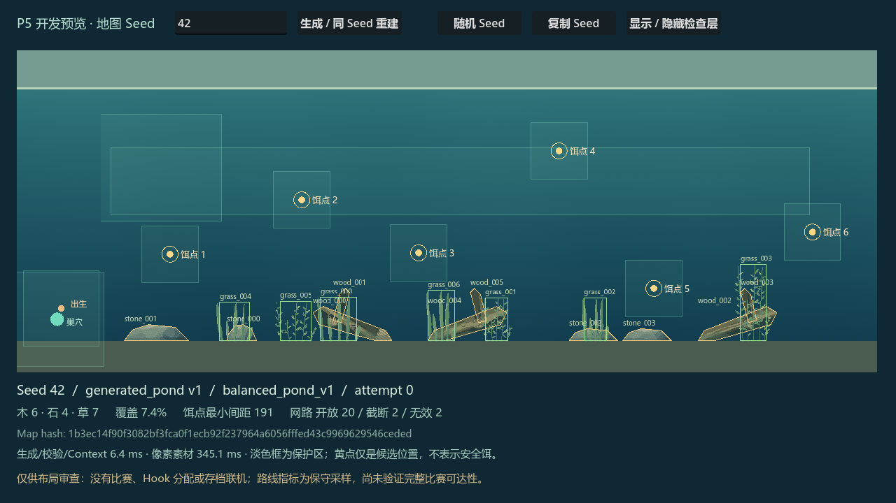
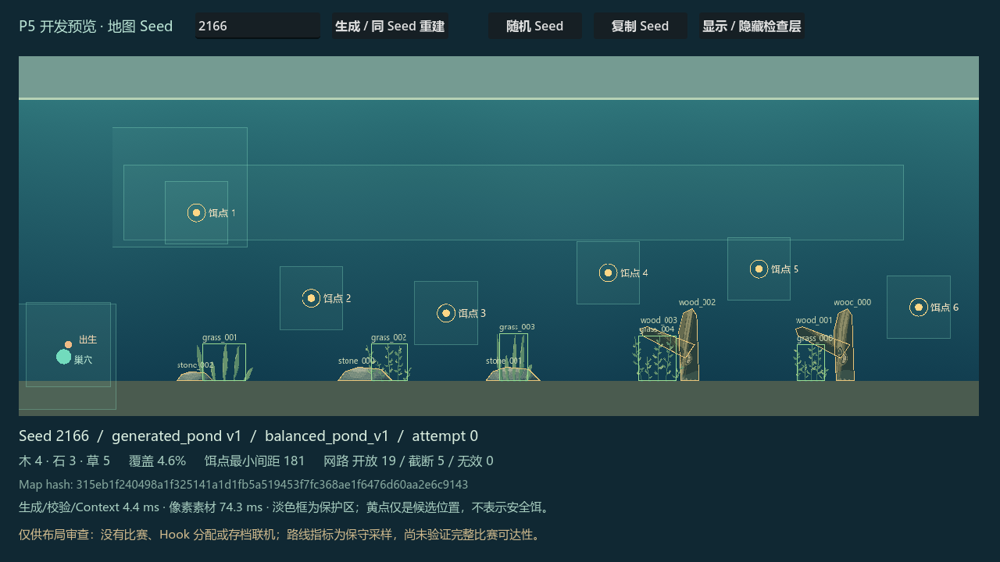
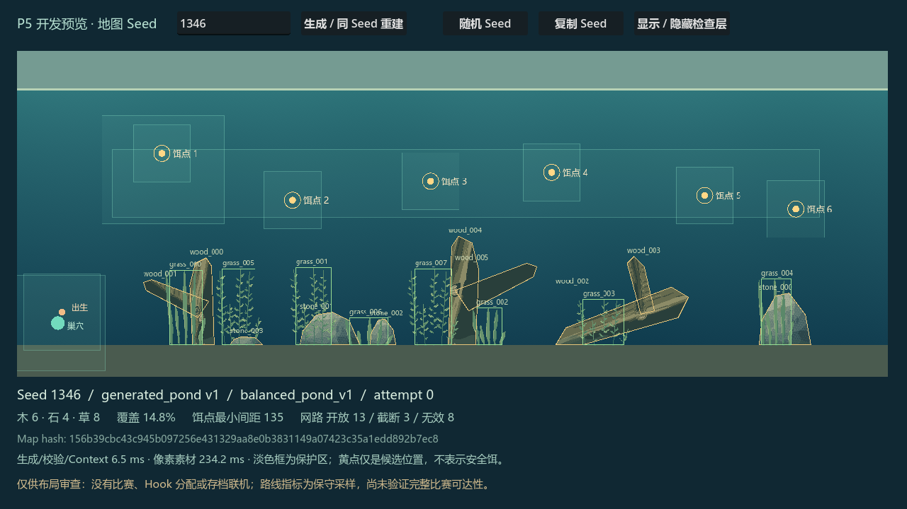
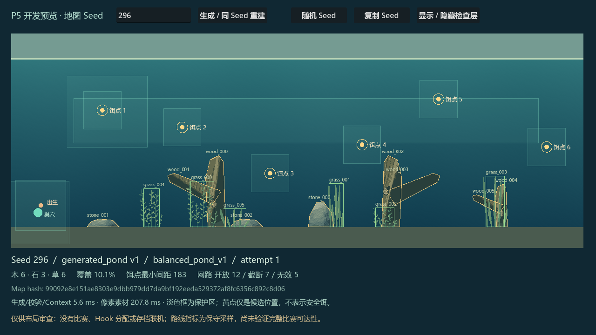

# 0.27.0 Phase 5 第一轮生成原型

日期：2026-10-05。用户授权依据 Phase 5 Draft v0.1 文档逐步开发、测试、提交推送。范围严格按第 49 节：P5.0 + P5.1 原型，批量验证和开发预览后停止。

基于 feature/dev 的 a110f52（0.26.4 之后已完成 0.26.5 右键移竿加速），未回退用户已确认功能。正常游戏仍为 pond_v2；Map Contract v1、Snapshot schema16、网络 MapRef 解析不变，仅同步 exact-build 标识为 0.27.0。本轮未构建正式游戏包或 Release。

## 分步交付

1. `4cb46ba`：严格 MapGenerationRequest、整数种子派生/独立 Map RNG、balanced_pond_v1 框架和保护区。603 项请求/随机源检查；既有控制 199 项通过。
2. `b93dcc0`：六个饵点、2–3 个连接木组（4–6 片几何）、3–5 个石块、5–8 片草；固定 topology + 整数变换；稳定槽 ID、fade_group_id；既有 MapDefinition/MapContext。首轮 403 项确定性、775 项能力/几何检查通过。
3. `af2ad03`：初版可玩性门和确定性重试（最大 32 次，无静默回退）；主动非法输入、10,000 seed 扫描与八类代表种子。
4. 本提交：独立原生开发预览、视觉 profile 修正、固定 Authority hash 对照、最终大样本复测与报告。没有创建 WorldSimulation 来试玩生成地图。

## 最终自动验证

Windows、Godot 4.7.2.stable.official.ed1daf0bf、D:/python/python.exe 3.11.2。原生使用 OpenGL Compatibility / AMD Radeon / Dummy 音频。

| 检查 | 通过 | 失败 |
| --- | ---: | ---: |
| `phase05_seed_sweep` | 20,000 | 0 |
| `phase05_generation_request` | 603 | 0 |
| `phase05_generator_determinism` | 506 | 0 |
| `phase05_generated_features` | 775 | 0 |
| `phase05_playability` | 17 | 0 |
| `phase05_native` | 54 | 0 |
| `editor-import` | 0 | 0 |
| `phase04_map_definition` | 808 | 0 |
| `phase04_map_snapshot` | 295 | 0 |
| `architecture_v020` | 60 | 0 |
| `phase04_map_network` | 282 | 0 |

生成器完全不依赖 world/scene/network 或其他随机源。100 个样本完整结果和 canonical 字节重复对照；0/42/最大支持 seed 的 Authority hash 固定为 v1 见证。改变视觉 profile/visual seed 元数据不改变 Authority hash，生成前后现有 World 全状态/RNG 字节相同。

原生预览检查 7 个 Seed，保存完整 1280×720 截图，检查连接木按组绘制、保护层仅改变像素、手动种子重建、非法种子不替换当前预览、正常默认地图仍是 pond_v2。不同布局的像素比较只取整个地图区域以排除含 Seed/计时的页脚，不作为跨平台全帧等价证据。人工查看了普通与密集截图，标记/图例可读；没有代替用户人工布局审查或手感测试。CLI 入口另以 seed 937 实际运行、导出截图并正常退出，PowerShell 启动器语法解析通过。

## 10,000 Seed 结果

两次独立执行 0..9999，每次各 seed 生成两遍，并额外经过完整 MapValidator + PlayabilityValidator。

- 10,000 个不同 Authority map hash，0 接受非法、0 非确定性、0 最终失败。
- 重试次数：0 次 7,728；1 次 1,769；2 次 392；3 次 84；4 次 19；5 次 5；6 次 3。
- 食物候选点最小间距范围 129–249.10 px，离 HOME 至少 128.88 px，离 SPAWN 至少 118.14 px。
- 覆盖指标范围 4.64%–14.83%；这是多边形面积求和，重叠重复计入，非精确并集。
- 24 条有限候选网路中，开放 12–21 条；同时保留被障碍截断的路线。指标使用默认网口膨胀包围盒，不能宣称完整游戏 Rope solver 或全部自定义参数可达。
- 首轮耗时 125.17 秒；最终复测统计见 seed-sweep-final.json，Authority 指标/重试/代表种子与首轮完全一致。最终生成时间包含双门校验，属于本机观察值。

[首轮完整统计](data/generation-0270/seed-sweep.json) · [最终完整统计](data/generation-0270/seed-sweep-final.json) · [八类回归种子](data/generation-0270/corpus.json)

## 保留失败与限制

- P5.0 最初使用 GDScript 保留参数名 namespace，测试解析失败；改为 domain 后通过，首轮日志保留。
- 开发预览第一次测试未显式标注 Dictionary 变量类型，编译失败；补齐类型后 54/54 通过。
- 基线 `phase04_map_network` 首次 281/282，鱼客户端 NPC 公共状态一致性断言失败。没有修改网络运行代码、测试条件或断言；独立原样复测 282/282。根因未定位，保留为一次不稳定结果，不把第一次运行写成全绿。
- 仅在 Windows 上实际执行，整数实现与 pinned hash 支持跨平台复现目标；尚未在 Linux/macOS 实跑。
- 本轮没有生成地图比赛、1,000 场比赛统计、生成地图存档/联网、全域 routing profile、Watergen 或跨电脑联机。后续需通过 P5.2/P5.3 再进入这些步骤。

本地证据：artifacts/phase05-step0*、phase05-step1、phase05-step2-small、phase05-step2-10000、phase05-final-generation、phase05-step3-preview（含失败）、phase05-step3-native-fixed、phase05-step3-network-recheck、phase05-preview-cli。

## 布局审查

[预览运行方法与边界](../architecture/MAP-GENERATION-PROTOTYPE.md#独立开发预览)。普通 42、开阔 2166、密集 1346、抄网受限 296 可用于第一轮审查；还可输入任意 0..2147483647 的整数。

