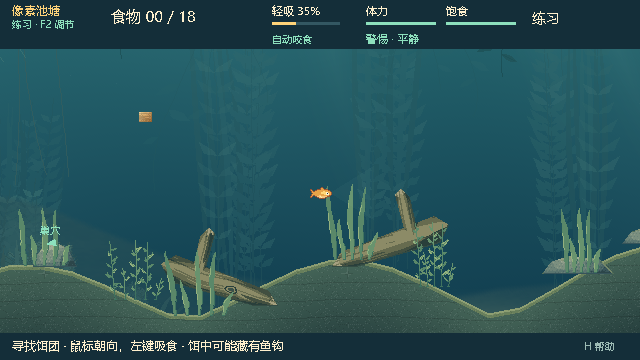
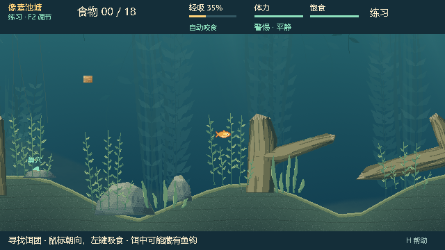

# 0.28.0 · 真实起伏水底

日期：2026-10-05。用户要求水下地势有高低起伏，并确认鱼、食物和抄网都受真实地形影响。

## 结果

标题 → 地图 → **起伏池塘 · 生成地图** → 输入 Seed → 使用这张地图。推荐先看 42、1346、2166。池底形成连续缓坡、高台与相对低洼，巢穴入口和附近水域保持平缓；地形最大抬升约 60–88 像素。不是在背景上画一条假坡线。

- 玩家鱼、上钩鱼和 NPC 使用同一条真实池底曲线，圆形身体对坡面和折点有净空，长距离移动分段处理。
- 抛钩、沉钩、整饵与食物颗粒不能进入土层。保留悬浮食物原有漂流规则，本次没有新增重力沉降生态。
- 抄网的起点、扫网路线、拖动和提网使用包含土层的多边形障碍。土层不是缠线目标，也不会随鱼接触而变透明。
- 木石与交互草按地势调整位置和高度；六个饵点保留横向分布，并避开抬升后的遮挡。保留原来的中央空间与六条提网通道检查。
- 鱼视角、抄网观察和岸边投影读取同一份地形。土层纹理在换图时准备，普通帧不重复烘焙。

新选择使用生成器 v2 / `relief_pond_v2` / Map Contract 2；地形顶点参与地图内容身份校验。旧生成器 v1、经典地图和 schema17 存档保持原布局。旧的地图偏好不会被静默换图，重新在标题应用生成地图即可选择 v2；相同生成器版本及 Seed 才代表相同布局。联机要求双方同为 0.28.0，仍在本地按配方重建地形，不传远程多边形。

Watergen 公共契约 v3 增加公开池底曲线；旧公共 v2 继续支持。WG-6.2 植物群落预览的根部也读取该曲线，但该批装饰植物仍未接入正式游戏。

## 验证

- 1,000 个结构 Seed 全部通过，最高使用第 5 次候选；原 v1 的 506 项确定性检查和经典地图的 122 项固定数据检查通过。
- 新地形套件 23,812 项通过：独立多边形距离核对圆形接触、陡坡/重复点拒绝、地形身份、长距离穿透、真实 World/NPC/食物、抄网提网、存档恢复与只读导出。
- 真实 ENet 两种角色、三张地图及六类非法握手：72 项通过；两端重建地形和运行时状态一致。
- 原生五图、观察视角、岸边视角、视觉 RNG 隔离、缓存与经典回归：81 项通过。菜单真实应用、同 Seed 重开、新地图、持久化及房间布局：22 项通过。
- 5 张地图 × 2 控制器 × 生存/对抗，共 20 完整局，全部合法结束、最终存档可恢复，最长 75.72 秒，没有检测到地形穿透或持续补饵死锁。按秒检查鱼/NPC/有效食物的地形约束；每 tick 接触检查由上述专用套件覆盖。此次没有重新宣称完成 P5 的千局发行矩阵。
- 完整 current profile：最终 83/83 套件、318,846 项断言通过，零超时/跳过。首次地图验证器遇到错误类型的 contract_version 时触发脚本错误；补齐类型检查后该套件 1,863 项复查通过，配方验证 603 项及新增类型回归也通过。[首次结果](data/terrain-0.28.0/current-initial.json)与[最终合并结果](data/terrain-0.28.0/current-resolved.json)均保留，未将初次失败记成通过。
- 最终 PCK 复跑地形 23,812、原生 81、UI 22 项，共 23,915 项通过。26 个改动的 runtime 脚本逐一直接比较包内字节，项目版本核对通过；ZIP CRC、四个文件与试玩说明逐字节核对通过；独立 EXE Seed 42 原生启动通过。只计算一个必要的 PCK 身份摘要，没有逐文件 SHA 扫描。

原始新地形首轮发现 Seed 8 的布局保护区冲突及坡度过大；修正生成布局和坡度限制后复跑通过，未放宽保护区验证。详细证据：[结构扫描](data/terrain-0.28.0/seed-sweep.txt)、[集成检查](data/terrain-0.28.0/integration.json)、[完整对局](data/terrain-0.28.0/rounds.jsonl)、[包内检查](data/terrain-0.28.0/package-tests.json)、[包元数据](data/terrain-0.28.0/package.json)。本机原始日志在 `artifacts/relief-*`。

## 画面与试玩

下图来自最终 PCK 的实际渲染，并已检查池底轮廓、画面层次和 HUD。试玩趣味性与平衡仍需人的反馈；20 个自动对局不能证明人类玩法公平。原有 Watergen 首次换图烘焙开销仍存在。

本地包：`E:\Fish_catches_people\Releases\BaitbreakPixel-0.28.0\BaitbreakPixel.exe`，对应 ZIP 为 `BaitbreakPixel-0.28.0.zip`。EXE 与 PCK 保持同目录。本次不发布 GitHub Release。
