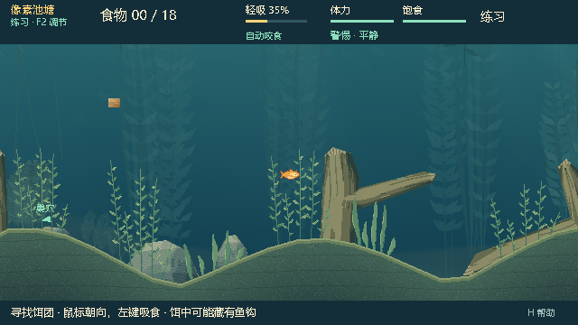
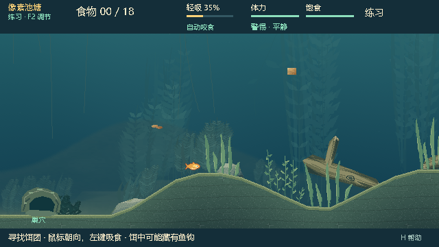

# 0.28.1 · 坡地物件贴地修正

日期：2026-10-05。用户截图指出：起伏水底已经生成，但树干、石头与部分草丛仍悬空。

## 修正

0.28.0 将整个物件组的包围框中心当作地面采样位置。树枝偏向一边时，该位置不在树干底座；石头的水平底边也无法靠一次中心采样贴合斜坡。另外，Watergen 在调整草丛横向位置后仍使用旧根部高度，视差会继续把草根移离地面。

- 木石按原始底座的实际接触区间定位，检查区间内整条地形；主干和枝干保持统一变换。底座埋入土层，由真实池底遮住地下部分，岸上投影使用缓存的裁剪轮廓。
- 交互草的轮廓沿地形折点生成，每根草茎单独取地面高度；缠线中心使用相同根部数据，弯曲时固定最浅根部以下的全部像素行。坡面高度差计入草丛纹理范围，避免裁掉叶尖。
- 装饰草在最终横向位置确定后重新落地，再提取动画；落地层与地面使用相同镜头位移，左右移动不再脱离坡面。巢穴底部接入土层。
- 小鱼、水下观察、岸上投影均读取当前地图的高度与形状。鱼、NPC、食物和抄网继续使用此前的真实地形约束。

新开局选择生成器 v3 / `grounded_pond_v3`，地图契约仍为 2。v1/v2 的生成器代码和配方继续可用；修正布局使用新版本身份，不改写旧配方。v3 沿用 v2 的地形随机流，但候选可玩性校验仍可能选择不同尝试。联机双方使用 0.28.1。

地图偏好实际只存地图种类和 Seed，新启动会选择当前生成器；此前 0.28.0 报告关于“地图偏好保留生成器版本”的描述不准确。完整对局快照带有版本，仍按原配方恢复。

## 验证

- 1,000 个 v3 Seed 全部生成成功，最高使用第 5 次候选；100 张地图检查木石完整底座和逐茎接地，并覆盖镜头移动、装饰根部、真实运动与快照恢复。
- 相关源码回归最终 **20 个套件、99,612 项断言通过**，包括地形、草缠线、相连木头、地图验证/显示、岸上投影、生成器确定性、存档、菜单及真实 ENet。此次按改动范围验证，没有重新运行完整 current profile。
- 初次旧地图等价性检查有 462 项失败：新加的空根部字段改变了经典地图的显示数据字典。已改为只给有坡地根部的草添加该字段，原等价性套件 3,036 项和草缠线 70 项复查通过，没有改弱旧断言。[初次结果](data/terrain-0.28.1/source-initial.json)、[修正复查](data/terrain-0.28.1/legacy-fix.json)、[最终合并结果](data/terrain-0.28.1/source-resolved.json)保留。
- 5 张地图 × 2 控制器 × 生存/对抗，共 20 完整局全部合法结束，最长 75.72 秒，无检测到的地形穿透或持续补饵死锁。[对局记录](data/terrain-0.28.1/rounds.jsonl)。
- 最终 PCK 复跑地形接地 67,298、原生多视角 111、菜单 22、草缠线 70 项，共 **67,501 项通过**。16 个修改的运行时脚本直接比较包内/源码字节，项目版本核对通过。ZIP CRC 与 4 个附件内容核对通过，独立 EXE Seed 42 原生启动通过。[包内测试](data/terrain-0.28.1/package-tests.json)、[包元数据](data/terrain-0.28.1/package.json)、[内容核对](data/terrain-0.28.1/package-bytes.txt)。

原始日志及全部多视角截图在 `artifacts/grounding-*`；未删除原失败记录。包内实际画面如下，已检查树干、坡面石头、草根与巢穴的衔接。这些检查不代表人类玩法平衡验收。

本地试玩：`E:\Fish_catches_people\Releases\BaitbreakPixel-0.28.1\BaitbreakPixel.exe`，同名 ZIP 已生成。保持 EXE 与 PCK 同目录。本次没有发布 GitHub Release。
