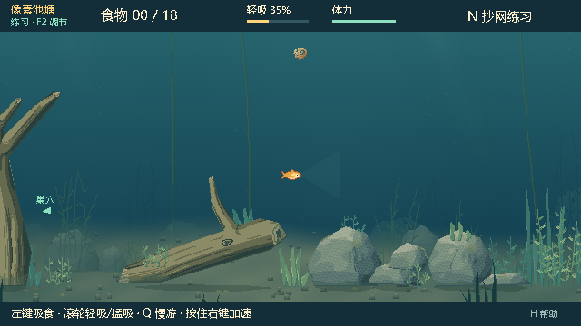
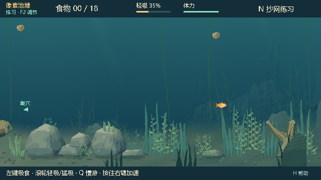
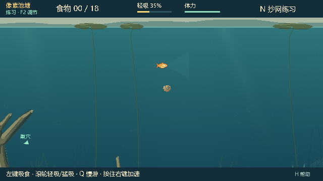
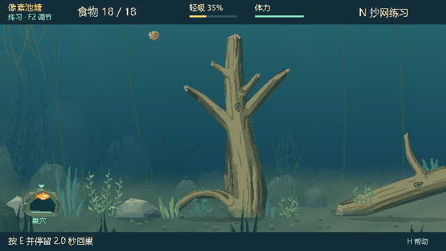

# 0.22.3 水下场景纵深验证

日期：2026-10-01（Asia/Shanghai）。分支 `dot/improve-baitbreak-20261001`，基于 `cb931f787421ef36f288499502dff4324e799457`。Windows、Godot 4.7.2 / GL Compatibility；运行检查使用隔离的 `--test-profile`。

## 场景变化

参考自然池塘的岩坡、水草、长茎浮叶、垂根和倒木形态，增加远中近景的尺度、明暗与移动差异。远处岩坡和草丛低对比淡化，中层岩石与草丛错落重叠，近处深色草叶与石块压住画面下缘。远景、浮叶、中景及前景分别采用不同镜头补偿，增强游动时的纵深。

水底由平直色块改为弯曲的远处床面、向远处缩小的沙砾和中部收窄的亮色通道。石块增加弧面明暗、宽背阴面、裂纹和局部苔藻；木材加强圆柱侧面的阴影。原木石多边形、接触透明、缠线和抄网轮廓保持原样。

`pond_depth_art.gd` 只生成装饰图像，六张 1280×480 原生像素纹理在初始化时准备并缓存，重开与绘制复用。新装饰不参与玩法几何，既有鱼、饵料、巢穴及互动反馈优先保持可辨认；绘制不改变 RNG 或权威世界。版本、菜单、日志、联机 build、默认目录和试玩说明同步为 **0.22.3**，快照仍为 schema 12。

## 原生画面

以下新版图来自发行 EXE，加载发行 PCK，使用固定模拟时刻 `elapsed=2` 的 640×360 原生视口，未进行后期重绘。

中部鱼位置 `(670,310)`，修改前（0.22.2）：

修改后：

右侧草丛 `(1080,330)`：

浅水 `(670,130)`：

巢穴达标反馈：

## 验证

源码 **222 项通过，0 失败**：`water_art` 14、`obstacle_art` 92、`water_scenery_native` 19、`pond_v021` 31、`architecture_v020` 44、`pond_native_v021` 9、实际双端 ENet `net_network_v021` 13。

新增检查覆盖各层整图尺寸、确定性、近处水底不透明及底部接缝、前景对上中层留白、六张缓存纹理重用。原生检查覆盖左右中部、浅水、巢穴、游动与掩体淡出、咬钩鱼线、隐藏鱼钩身份、镜头指针转换和回巢反馈。材质检查逐像素确认所有木石仍严格占据原权威轮廓。

独立发行目录加载包内源码和素材，测试脚本从外部载入：`water_art` 14、发行 EXE 的 `water_scenery_native` 19、`pond_native_v021` 9、`feeding_feel_native_v022` 24，共 **66 项通过，0 失败**。吸食检查确认钩饵与散饵均移动，轻吸/猛吸的形变、拖尾和入口反馈不会暴露鱼钩身份。直接运行发行 EXE（不指定脚本或 PCK）确认正常自动加载主场景、菜单和版本 0.22.3，退出码 0，原生标准错误输出为空。

发行 PCK 内 **43 个脚本**的 SHA-256 均与本次源码一致；ZIP 内四个文件均与发行目录逐字节一致。所有运行日志未出现 `SCRIPT ERROR` 或 `ERROR:`。此轮没有进行广域网压力验证。

## 本地试玩包

- EXE：`E:/Fish_catches_people/Releases/BaitbreakPixel-0.22.3/BaitbreakPixel.exe`，与 PCK 保持同目录。
- ZIP：`E:/Fish_catches_people/Releases/BaitbreakPixel-0.22.3.zip`，91,295,570 字节。
- PCK：4,037,548 字节；SHA-256 `4C3321C402C67D6667E4DC9A913EC3C3EBF05BA8462ACB7A757916120C496008`。

本次创建本地 0.22.3 试玩包，保留 0.22.2 历史目录与 ZIP，未发布 GitHub Releases。
