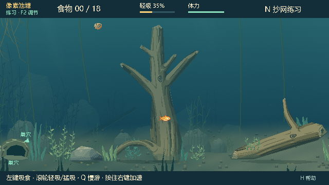

# 0.22.4 整木透明效果验证

日期：2026-10-01（Asia/Shanghai）。分支 `dot/improve-baitbreak-20261001`，基于 `527143324d8198490cfcc80727added4df448da6`。Windows、Godot 4.7.2 / GL Compatibility；运行检查使用隔离的 `--test-profile`。

## 修正

此前接触透明度按主干、枝干和根系的独立目标更新，鱼进入主干时，未接触的枝干仍不透明。现在相连部分共用 `PondLayout.WOOD_GROUPS`：接触其中任一部分会使整组同步淡出，在主干与枝干之间移动不会恢复其他部分，离开整组后统一逐渐恢复。默认仍为 68% 不透明度，遵循原 `cover_opacity` 设置及淡出速率。

相连木头在初始化时先将原有不透明材质图合成一张缓存纹理，再整体绘制一次。透明后的主干、枝干连接处不会重复混合而形成深色接缝。三个木头组彼此独立，石块和草丛保持独立透明效果；接触目标选择、缠线、抄网和权威多边形保持原样。使用既有 `target_opacity` 快照字段，schema 12 不变。

项目版本、菜单、日志、联机 build、默认目录和试玩说明同步为 **0.22.4**；联机双方使用同版。

## 原生画面

以下图来自发行 EXE 与 PCK，鱼位置 `(350,350)`、固定模拟时刻 `elapsed=2`，使用默认透明设置，未进行后期重绘：

## 验证

源码 **182 项通过，0 失败**：`wood_fade` 57、`wood_junctions` 20、`wood_fade_native` 17、`pond_v021` 31、`architecture_v020` 44、实际双端 ENet `net_network_v021` 13。

覆盖全部十个木头部件的进入、整组同步淡出、其他木头独立、主干到枝干切换、离开后逐渐恢复、石块独立、快照恢复与继续模拟。材质检查确认合成纹理逐像素等于原轮廓并集和原材质；原生像素检查同时采样枝干独占区域及主干连接处，确认只发生一次共同透明混合，并检查绘制确定性及默认设置。

独立发行目录加载包内源码和素材，测试脚本从外部载入：`wood_fade` 57、`wood_junctions` 20、发行 EXE 的 `wood_fade_native` 17、`obstacle_visuals_native` 16、`pond_native_v021` 9，共 **119 项通过，0 失败**。回归覆盖缠草、整物透明、隐藏鱼钩、咬钩鱼线、镜头坐标和抄网。直接启动 EXE（不指定脚本或 PCK）正常自动加载主场景及菜单，显示版本 0.22.4，退出码 0，原生标准错误输出为空。

发行 PCK 内 **43 个脚本**的 SHA-256 均与本次源码一致；ZIP 内四个文件均与发行目录逐字节一致。所有最终运行日志未出现 `SCRIPT ERROR` 或 `ERROR:`。此次没有进行广域网压力验证。

## 本地试玩包

- EXE：`E:/Fish_catches_people/Releases/BaitbreakPixel-0.22.4/BaitbreakPixel.exe`，与 PCK 保持同目录。
- ZIP：`E:/Fish_catches_people/Releases/BaitbreakPixel-0.22.4.zip`，91,296,544 字节。
- PCK：4,039,884 字节；SHA-256 `9482C8EE1D7AA93673A50F55B6F3B7872BACF7772DAB05FE709AA085A64D0CAC`。

保留 0.22.3 目录与 ZIP；此次创建本地试玩包，未发布 GitHub Releases。
