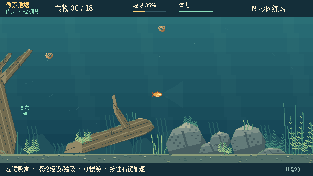

# 水底障碍物外观验证

日期：2026-10-01（UTC）。基于 `main` 的 `db215eb0440375ea3a31896aa056367c2ba1e711`，这是未发行的纯显示层改进。

## 外观改动

- 沉木：沿弯曲枝干的木纹、断续的水浸暗树皮、局部节疤、倒木的风化断口；减少整齐平行条纹的木板感。
- 石头：不重复的明暗体块、细裂纹、少量矿物颗粒和上沿苔藻，替代棋盘式斑点。
- 水草：渐细且有折面的带状叶，交错、不对称的水生叶丛；保留像素比例、前后层次和开阔游动空间。

地图与木石碰撞多边形完全未改。木石输出的每个不透明像素仍与原多边形填充一致；植物的茎中心线、根部、裁剪范围、8 帧周期、缠草变形和目标淡出保持。未改 QTE、吸食、抄网判定、玩法规则、快照或联机版本。

## 原生前后对比

同一鱼位置 `(670,310)`、同一模拟时刻 `elapsed=2`、640×360 原生视口；没有缩放、后期重绘或合成。

修改前：



修改后：


还检查了树桩区 `(280,310)`、右岸草丛 `(1080,330)`、三类草丛的缠线进度和透明遮挡。鱼、饵粒与线圈仍可辨认；未见草根漂移或贴图撕裂。

## 实测环境与结果

Linux，Godot **4.6.3 stable**，原生 X11 窗口，Compatibility / Mesa llvmpipe。项目原有 Windows 文档指定 **4.7.2**，本次未在 Windows 4.7.2 或 Windows 发行包上复测，也未创建新发行包。所有命令使用隔离的 `--test-profile`。

| 检查 | 结果 | 主要覆盖 |
| --- | --- | --- |
| headless editor import | 通过 | 当前所有脚本解析与资源导入 |
| `obstacle_art.gd` | 92 通过 / 0 失败 | 18 个木石纹理的确定性、缓存位置、精确轮廓、二值透明度、材质层次与几何不变 |
| `plant_art.gd` | 176 帧，16,578 个逐点/逐帧断言通过 | 原始中心线、根锚点、裁剪无截叶、确定性、二值透明度及随机源不变 |
| `feeding_movement_v0221.gd` | 28 / 0 | 吸食游速、松开恢复、快照重放 |
| `feeding_feel_v022.gd` | 27 / 0 | 吸食、咬钩、反馈与插值 |
| `architecture_v020.gd` | 44 / 0 | 世界/显示分层、快照、重放与共同结算 |
| `pond_v021.gd` | 31 / 0 | 地图、水草坐标、镜头与可见性 |
| `grass_binding_v021.gd` | 70 / 0 | 线圈贴茎、根部锚定、聚拢与退线 |
| `line_motion_v021.gd` | 29 / 0 | 线条动画连续性及重开清理 |
| `net_v021.gd` | 43 / 0 | 木石挡网、路线与捕获 |
| `net_network_v021.gd` | 13 / 0 | 本机真实 ENet、远端操作与同步捕获 |
| `pond_native_v021.gd` | 9 / 0 | 原生鱼视角/观察视角、输入、隐藏钩与绘制不改世界 |
| `obstacle_visuals_native.gd` | 16 / 0 | 原生缠草、固定根部、重复帧一致、快照不变与 100%/25%/0% 淡出 |

图形驱动报告不支持切换 V-Sync。原有 `pond_native_v021.gd` 在退出时仍报告基线已有的 ObjectDB 实例清理警告；新增原生测试正常清理，没有该警告。以上为本次相关检查，不代表所有保留的历史版本测试都适用于当前版本。

## 复现

无图形窗口的像素与逻辑检查：

```sh
godot --headless --path . --script res://tests/obstacle_art.gd -- --test-profile
godot --headless --path . --script res://tests/plant_art.gd -- --test-profile
godot --headless --path . --script res://tests/grass_binding_v021.gd -- --test-profile
godot --headless --path . --script res://tests/net_v021.gd -- --test-profile
```

原生窗口检查与截图（不能加 `--headless`）：

```sh
godot --path . --rendering-method gl_compatibility --audio-driver Dummy --resolution 1280x720 --script tests/pond_native_v021.gd -- --test-profile --capture-output-directory=res://artifacts/obstacles-after
godot --path . --rendering-method gl_compatibility --audio-driver Dummy --resolution 1280x720 --script tests/obstacle_visuals_native.gd -- --test-profile --capture-output-directory=res://artifacts/obstacles-after
```

脚本自动创建截图目录。受限环境可把 `XDG_DATA_HOME`、`XDG_CONFIG_HOME`、`XDG_CACHE_HOME` 指向可写的隔离目录；原生检查必须在有正常图形显示的会话运行。
