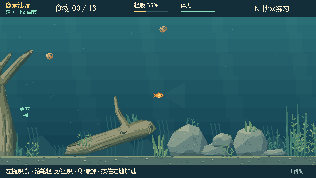
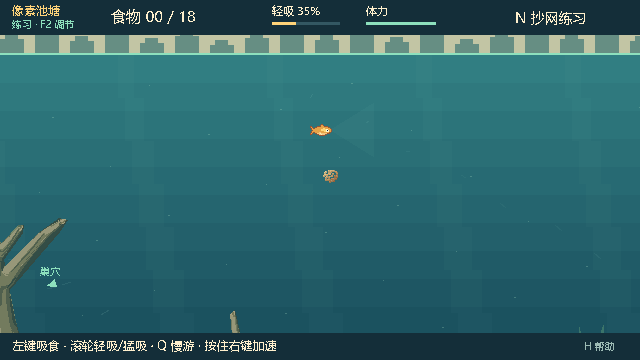
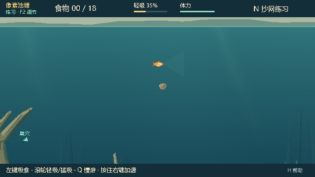
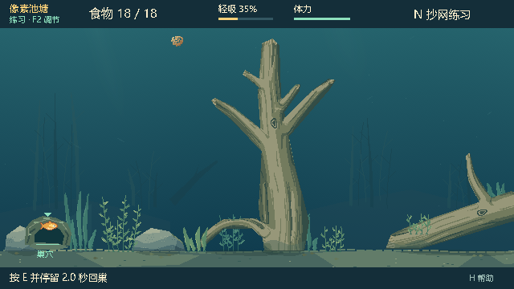

# 水体层次、水底与自然巢穴验证

日期：2026-10-01（Asia/Shanghai）。分支 `dot/improve-baitbreak-20261001`，基于 `0629957f8e1bbc3ac155f3519515b5ee4c26746f`。Windows、Godot 4.7.2 / GL Compatibility；所有检查使用隔离的 `--test-profile`。

## 改进

水体由粗横向色带和矩形光柱改为原生像素的连续深浅渐变、细微颗粒和边缘渐隐的斜向透光。远岸轮廓改为连续、不规则起伏；七组低对比远处水草、两段倒枝和远处泥坡为中层提供参照。远景按镜头偏移的 10% 水平、4% 垂直补偿作轻微视差，上中层仍保留大面积开阔水域。

`pond_water_art.gd` 只生成显示图像；两张 1280×480 纹理在视图初始化时准备，重开和绘制复用。悬浮物位置固定且稀疏，漂动仍读取既有水流，不使用或推进世界随机源。实际木石和水草仍使用原有世界坐标、轮廓、遮挡及缠线规则。

水底增加低矮断续的床沿、局部沙泥斑块、落叶和落地木石的接地阴影。巢穴外观改为带苔藓的树根拱洞；食物达标时入口亮起并出现箭头，目的地 `(60,401)`、按 E 回巢及原判定保持。

此次为显示层改进。玩法规则、碰撞目标、鱼的运动、吸食与咬钩、抄网、快照 schema 12 和联机 build 0.22.1 保留。新增远处草木不参与交互。钓鱼人观察继续使用原有权限与画面逻辑。

## 原生画面对比

中部鱼位置 `(670,310)`、模拟时刻 `elapsed=2`、640×360 原生视口，分别来自旧分支包与本次发行包，未进行后期重绘：

修改前：

修改后：

浅水位置 `(670,130)`：

食物达标后的树根巢穴：

已目视检查左、中、右段、浅水、穿过枯木和咬钩后的画面，鱼、饵料、鱼线及目标标识仍可辨认。

## 验证

源码 **113 项通过，0 失败**：`water_art` 10、`water_scenery_native` 19、`architecture_v020` 44、`pond_v021` 31、`pond_native_v021` 9。栅格检查覆盖整图、确定性、透明接缝、横向色带、远景低对比与留白、悬浮物和状态不变；原生检查覆盖六个区域的固定画面、缓存复用、实际游动、目标淡出、鱼线、隐藏鱼钩、镜头输入及回巢目的地与达标反馈。

水体相邻行的平均 RGB 变化最大为 0.00585，低于用于排查明显整行色阶的 0.018 阈值；上中层检查区域中，远景之外的透明留白超过 90%。这些数值用于回归检查，不代替原生画面的目视判断。

独立发行目录加载包内代码和素材，测试脚本从外部载入。`water_art` 10、发行 EXE 的 `water_scenery_native` 19、`pond_native_v021` 9，共 **38 项通过，0 失败**。原生标准错误输出为空；另直接运行发行 EXE，不指定脚本或 PCK，确认正常载入同目录 PCK 与主场景。

## 本地试玩包

- EXE：`E:/Fish_catches_people/Releases/BaitbreakPixel-0.22.1-water-depth-20261001/BaitbreakPixel.exe`，与 PCK 保持同目录。
- ZIP：`E:/Fish_catches_people/Releases/BaitbreakPixel-0.22.1-water-depth-20261001.zip`，91,293,873 字节；五个文件均与独立发行目录内容一致。
- PCK：4,030,312 字节；SHA-256 `D5743C8C69A051E4A5D64B3F56042AD682F36856CB2C0E321D8387D4A91D5F79`。
- 包内截图：`artifacts/water-depth-pack-water_scenery_native/`、`artifacts/water-depth-pack-pond_native_v021/`。

此前的 `BaitbreakPixel-0.22.1-improve-20261001` 包保持不变。本次创建本地试玩包，未发布 GitHub Releases；没有重新进行广域网联机压力验证。

后续发行说明：当前试玩目录已更名并重打包为 `BaitbreakPixel-0.22.2`，原长名称 ZIP 保留上述历史验证包。当前版本与包信息见 [0.22.2 发行验证](TEST-REPORT-0.22.2.md)。
