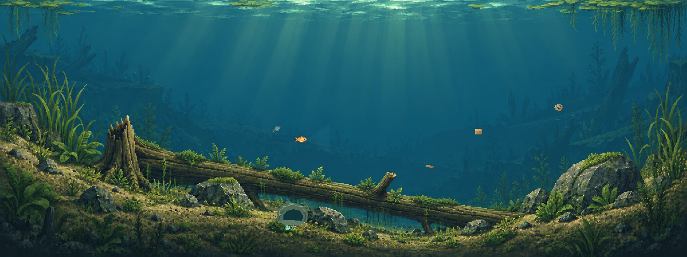
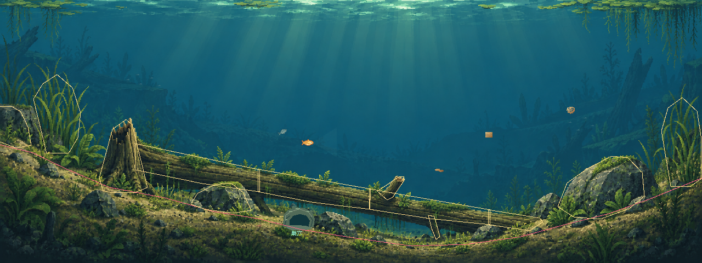
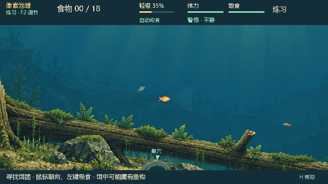
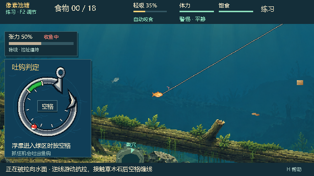

# 0.29.0 · 固定自然池塘接入

本轮按用户最新确认“改为匹配新图的固定地图，保留现有玩法规则”执行。新的 Watergen 沟谷倒木场景已成为正常游戏默认地图；随机地图开发暂停，普通菜单撤下生成器与 Seed 入口。经典池塘仍可选择，旧生成器/快照兼容路径保留，不继续扩展随机生成算法。

## 场景与真实空间

使用 `feature/watergen-v2` 工作树的 `A-plant-communities.png`，不是此前被否定的程序圆丘方案。原画与世界统一为 1280×480 比例；保留两岸长坡、中央宽谷、一根斜向倒木、成组岩块与中央开放水域。

固定地图 `woodland_pond@1` 使用手工标定的非周期折线池底；十个木石接触片区和两处两岸高草组成 12 个稳定目标。倒木各段共享淡化组。真实土层、抄网阻挡、鱼/NPC 活动范围、候选饵位和巢穴均使用这张固定地图的数据。木石依然可让鱼穿行、可缠线并阻挡抄网，高草仍沿用原缠线形变，没有另造玩法规则。

前景使用独立的视觉蒙版从原画组装缓存纹理，透明时露出干净底图，避免主干消失后留下重复木纹、悬浮苔藻或整块矩形。主干与枝干共同淡化；抄网视角先合成完整场景，再施加原来的可达性遮罩，避免单个图层调色造成分块边缘。底图来源和生成要求见[素材说明](../../assets/woodland_pond/README.md)。

背景植物和光束沿用原画，不额外堆叠新生态元素。新场景已有的 3 只小虾、2 只蜗牛和两组共 10 条远景小鱼使用独立本地时钟；不创建 NPC、食物或网络实体，不消费比赛 RNG。附着蜗牛随宿主淡化。它们不参与抢食或胜负。

## 玩法与信息边界

- `world_simulation.gd`、摄食、NPC AI、QTE、缠线求解及抄网模拟未修改；通过既有 MapContext 能力接入新的空间数据。
- Snapshot 仍为 schema17，鱼公共投影仍为 schema3；不新增网络协议字段。两张内置地图分别缓存、分别核验版本和内容标识，双方必须使用 0.29.0。
- 默认入口迁移旧选图偏好到新场景；记录、规则和设置保留。明确重新选择经典池塘后会保存该选择，R 保留当前地图。
- 隐藏钩真值翻转前后，鱼视角截图逐像素相同；绘制前后权威快照逐字节相同。背景不会读取隐藏钩或内部 NPC 状态。

## 修改文件

| 范围 | 文件 |
| --- | --- |
| 固定地图及加载 | `scripts/maps/woodland_pond_map.gd`、`map_registry.gd`、`map_context.gd`、`map_resolver.gd` |
| 图像、缓存与装饰 | `assets/woodland_pond/*`、`scripts/watergen/woodland_pond_art.gd`、`woodland_fauna.gd` |
| 主视角及抄网观察 | `scripts/pond_view.gd`、`pond_scenery.gd`、`net_observation.gd` |
| 默认入口与版本 | `scripts/pond.gd`、`menu.gd`、`network_protocol.gd`、`project.godot`、`Build-Pixel.ps1` |
| 验证 | `tests/watergen/woodland_*.gd`、`tools/watergen/run_woodland_checks.py`；现有选图测试、内置地图数量与版本断言同步更新 |
| 说明 | README、试玩/联机说明、开发记录、Watergen 索引与本报告 |

经典等价见证现在明确筛选 `pond_v2`，不再假设注册表只有一张地图；经典内容的严格断言继续保留。`phase05_ui` 改为验证已经取代 Seed UI 的固定选图界面。

## 验证结果

Windows / Godot 4.7.2 / Compatibility 渲染。使用有超时的测试入口，日志保存在[本轮证据目录](../watergen/evidence/woodland-0.29.0/)。

- 固定地图约束、900 tick 快照重放、鱼/抄网地形约束、草丛缠线根部与连线、接触淡化：139 项通过。
- 两个房主角色的真实 ENet 握手、准备、开局、公共状态同步及中途地图替换拒绝：18 项通过。
- 默认入口、旧偏好迁移、两种固定地图切换、保存/重开与联机选图限制：13 项通过。
- 原生场景、三处镜头、草丛缠线、木草淡化、QTE、抄网观察、隐藏钩像素相等与渲染不改权威：28 项通过；包括经典地图往返后新场景缓存不被清空的检查。
- 相关 15 组既有回归全部通过：地图定义/校验/上下文/权威/快照/网络/等价见证/呈现/岸边投影/异形地图/原生渲染、草丛缠线、架构及地形约束，共 50,518 个断言。未声称全仓库所有历史套件通过，也未继续执行随机地图大规模开发筛选。

- 导出的 PCK 再运行固定地图约束 139 项和原生检查 28 项，全部通过；实际 `BaitbreakPixel.exe` 启动、0.29.0 版本日志与截图保存成功，无引擎错误。源码与包内完整场景截图一致。

运行：`D:\python\python.exe tools/watergen/run_woodland_checks.py --godot "Godot控制台路径"`。

本地包：`E:\Fish_catches_people\Releases\BaitbreakPixel-0.29.0\BaitbreakPixel.exe`；ZIP 同名。本轮不发布 GitHub Release。自动检查确认运行、空间接入与原有规则约束；构图喜好和实际博弈体验仍由用户试玩判断。

