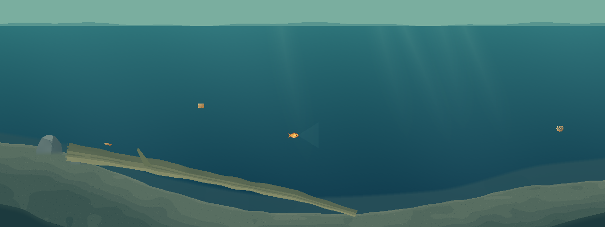
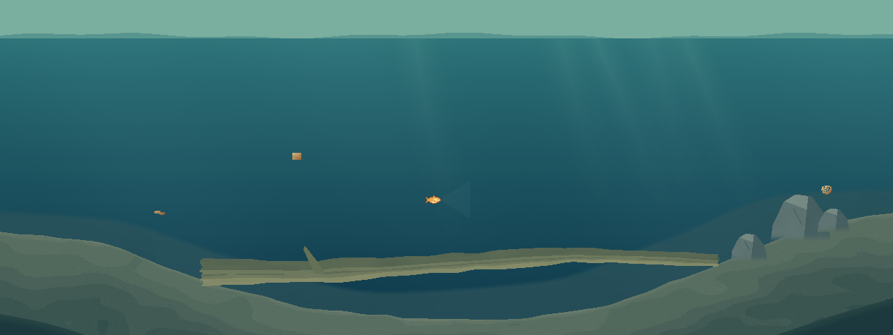
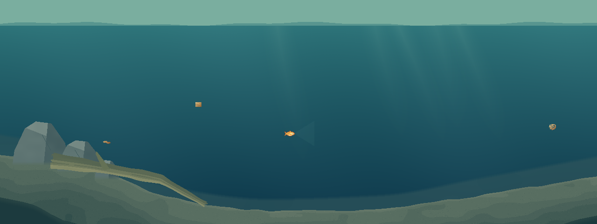

# 第一轮重做：只评审地形与大构图

2026-10-06。上一版未通过视觉验收，本轮重新绘制完整 1280×480 草案，不继续植物、动物或生态细节。

[打开三方案对照页](COMPOSITION-ROUND1.html)

| 草案 | 主要形体 | 土层占画面 | 局部前景占画面 |
| --- | --- | --- | --- |
| A · 斜木宽谷 | 左高右中，中央宽谷，一根从左岸斜落到谷底的倒木 | 16.10% | 0.90% |
| B · 双岸跨谷 | 两侧高、中部低，一根主倒木跨过谷地，石块体量集中右岸 | 17.01% | 1.09% |
| C · 石坡浅湾 | 左侧集中石坡，中央低谷，右侧长缓坡；短倒木附在左坡 | 14.22% | 0.97% |

占比根据不透明图层的实际像素统计；不包括低对比的远景坡岸。石块目前只表现集中体量和大切面，未做碎石、苔藻等细节。

## 改了什么

- 移除草案中的旧圆丘轮廓、重复倒木、植物及杂物。每套只保留两岸和一个宽谷，不用增加元素填补构图问题。
- 以不等距、手工定义的控制点塑造长坡，用保形插值连接；主要轮廓不使用正弦或周期函数。噪声只用于最多 2 像素的岸缘扰动和低对比材质，不能改变主要坡形。
- 每套只有一根主倒木，两端与草案坡地接触。岩体集中成组，没有平均撒布。
- 前景仅压住两个不等大的底角，中央没有贯穿屏幕的高墙。560×260 的中央水域没有地形、木石或前景占用。
- 拉开远景低对比轮廓、中景泥沙与木石、近景暗色压角的尺度和明暗。沿用原有水色与光照，没有新增植物、动物、浮叶或垂根。

## 玩法边界

这是**冻结的美术构图草案，不是可游玩的新地图**。草案轮廓完整重画，不再被旧碰撞地形的三个圆丘限制。正式游戏仍使用原来的地形与交互对象，未把草案接入 Main/PondView。

草案临时不画原有植物、交互杂物和 NPC；这些对象没有从真实世界中移除。保留原有玩家鱼、公开食物、鱼线以及可切换的 HUD/QTE 叠加，用于尺寸和可读性检查。碰撞、鱼可游区域、缠线、抄网、饵位、NPC、同步与快照协议均未修改。

## 修改文件

- `data/watergen/composition_studies.json`：重新定义 A/B/C 的坡面、单木、集中石块体量与局部前景。
- `scripts/watergen/pond_composition_plan.gd`：手工坡形插值，明确 preview_only；不再把实际碰撞轮廓作为草案轮廓。
- `scripts/watergen/pond_composition_baker.gd`：地势、木石体块和局部前景绘制。
- `tools/watergen/composition_appearance.gd`、`composition_view.gd`、`composition_review.gd`：独立草案图层、原版对照、界面说明。
- `tests/watergen/composition_boundary.gd`：自然坡形、开放区、面积、倒木接地和状态隔离检查。
- 对照页、本报告与截图证据；原始第一版报告标注未通过。

## 验证

Godot 导入通过，三项检查共 **212 项通过、0 失败**。最终结果见 [检查记录](evidence/composition-round1-rework/results.json)。

- 1280×480 完整全景，另外保留 640×360 HUD 和鱼线/QTE 叠加截图。
- 两张地图、三套草案：主要坡形不受地图种子或视觉随机数改变，单一宽谷没有额外极值。
- 对主倒木接地、中央开放区、前景面积和位置逐像素检查。
- 原版与草案的 HUD、提示条和 QTE 内部像素相同；只翻转隐藏钩真值，草案鱼视角像素不变。
- 绘制前后完整状态不变；两张地图各推进 600 tick，有/无视觉生成的世界状态相同。

本机预览：运行 `tools/watergen/Open-Composition-Review.ps1`。本轮未制作新试玩包，也未更改版本号。等待选定 A/B/C 后再讨论下一轮细节。
