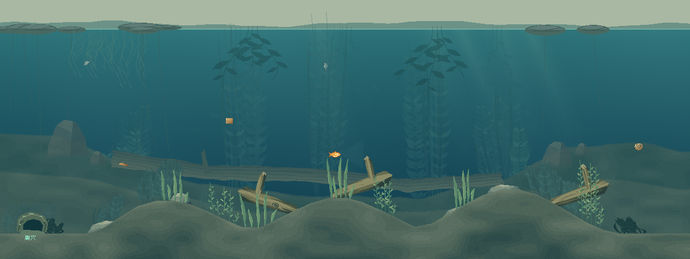
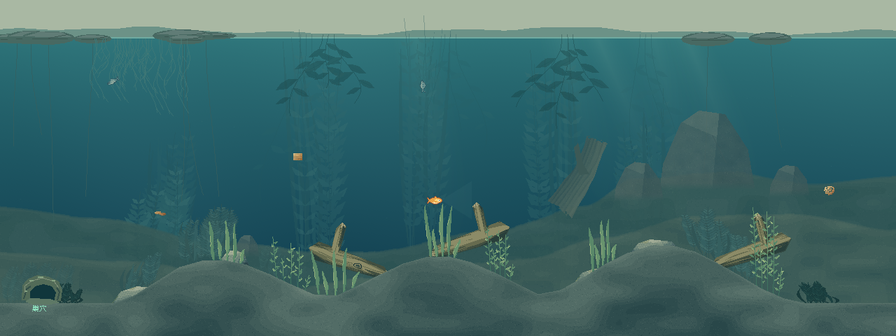
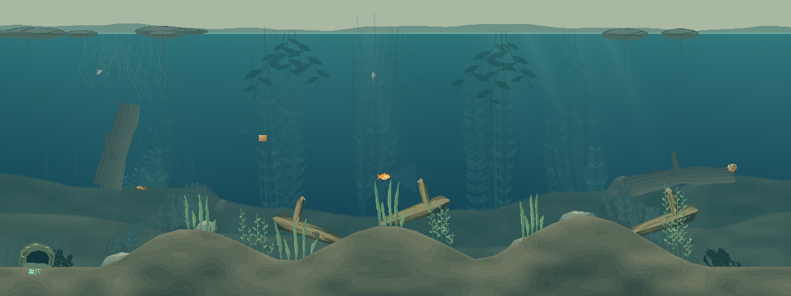

# 第一轮：地势与大构图 · 三套方向

2026-10-06，基于 `feature/dev@4a76d19` 的 0.28.1。仅新增独立视觉预览，正式游戏入口、玩法代码及版本号保持原样。参考图用于提取两岸围合、沟谷横木、大小石组合和远近对比关系，没有复制原图素材。

[打开可切换对照页](COMPOSITION-ROUND1.html)：A/B/C、原版、两张地图、全景/实际 HUD/QTE 均可切换。

| 方案 | 大构图 | 下一轮植物适合生长的位置 |
| --- | --- | --- |
| **A · 宽谷倒木** | 不对称两岸围出宽谷，横向长倒木串起左右，小石陪衬两端。三个方向中最接近参考图的空间关系。 | 谷底、倒木下方与两岸坡脚；中央上方保持通透。 |
| **B · 偏岸石坡** | 右岸大石、邻近小石和斜木形成重心，左侧缓滩打开视野。地貌重心最鲜明。 | 右侧石缝、坡脚；左侧稀疏低草。 |
| **C · 浅滩泥台** | 两端短木与低石收边，错层泥台和浅滩把中央空间留得最宽。 | 泥台边缘与浅沟成片分布，活动区保留更多空隙。 |







## 本轮边界

本轮重做**装饰地貌、大形体与现有土层材质**。远处坡岸使用不等距、非对称的轮廓节点；前景土层改为不规则泥沙斑块和破碎沉积边缘，去掉整齐条纹。新增远处木石保持低对比，真实交互木石仍以原轮廓绘制。

可碰撞池底保持原状，因此近处三段真实起伏仍能看到。本轮的宽谷属于远景构图，**不是新增的可游沟谷或可缠线倒木**。若以后要把近处物理地形也改成两岸高中间低，需要另行授权修改玩法地形；本次不做。

植物、顶部浮叶/垂根、光束沿用原有内容；没有新增植物群落、小虾、蜗牛或鱼群，也没有开始第二、三轮。画面里原有 NPC 来自同一冻结局面。本轮先选择大构图，木石材质与生态细节仍可继续细化。

## 新增文件

- `data/watergen/composition_studies.json`：三套构图参数。
- `scripts/watergen/pond_composition_plan.gd`、`pond_composition_baker.gd`：只接收公开地图数据，生成装饰层和池底材质；不接收 World 或隐藏钩数据。
- `tools/watergen/composition_appearance.gd`、`composition_view.gd`、`composition_review.gd`，及 `scenes/watergen/composition_review.tscn`：独立预览、三方案缓存、同图对照；复用原来的鱼、食物、鱼线、QTE、HUD 绘制。
- `tools/watergen/Open-Composition-Review.ps1`、`run_composition_review.py`：本地启动及有超时的检查入口。
- `tests/watergen/composition_boundary.gd`、`composition_native.gd`、`composition_review_ui.gd`：隔离、实际画面与切换检查。
- 本报告、HTML 对照页、代表截图与检查结果。

已有的碰撞、鱼可游区域、缠线、抄网、饵位、NPC、网络及快照文件均未修改。原有 Main/PondView 没有引用本轮新模块；本轮不制作或发布新的游戏包。

## 如何验证

Godot 导入通过；三项检查共 **182 项通过，0 失败**：[结果](evidence/composition-round1/results.json)。

- 两张当前 v3 地图，各 600 tick：有/无视觉生成的完整状态逐 tick 相同，覆盖主 RNG、NPC、食物、隐藏钩、位置与绳网状态。
- 所有像素检查：新土层的透明遮罩与原有真实池底逐列一致，不在水域内新增实地。
- 两图 × 三方向：实际 1280×480 全景和 640×360 游戏视角；绘制前后快照一致；重复帧像素一致且不重复烘焙。
- HUD、提示条和 QTE 内部像素与原版一致。只翻转隐藏钩真值、不改变公开外观时，整张鱼视角截图一致。
- 预览切换 A/B/C 和全景/HUD 不推进模拟。原生 UI：[截图](evidence/composition-round1/review-controls.png)。

本机交互预览：在项目根目录运行 `tools/watergen/Open-Composition-Review.ps1`。检查命令：

```powershell
& 'D:\python\python.exe' tools/watergen/run_composition_review.py --godot 'E:\chrome下载\Godot_v4.7.2-stable_win64.exe\Godot_v4.7.2-stable_win64_console.exe'
```

目前等待用户选择 A/B/C，再开展第二轮植物群落。未将构图草稿记为最终视觉验收。
