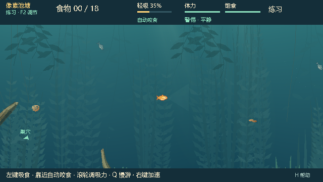
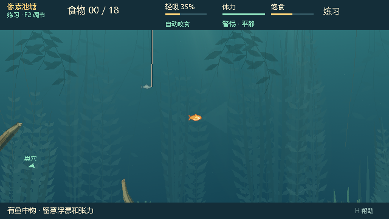

# 0.25.6：同步 feature/dev 到 watergen

用户明确要求将 `feature/dev` 最新改动同步进 watergen。本轮从 `392d1266b84cc525d2b0ebc405fd4d2d8ffda796` 合并 `origin/feature/dev @ dfdd9af72e3700c4b82fcf32419ff998231d7ef9`，共同祖先为 `c1e3946f0b8cf1afa7becf2b238c8297efda5dc8`。

## 合并范围

已接入上游 P3.2 NPC 觅食与真实食物竞争、P3.3 社会反应、P3.4 NPC 误咬钩及其完整生命周期，以及 0.25.4 的玩家 QTE 入口/同批输入修复和 NPC 收近速度调整。沿用上游参数与逻辑，不在整合时额外调整平衡。

保留 watergen 四种构图及默认种子 713284、中上层近远景、木石与草叶材质、双构图缓存、本地视角限制和失败回退。水域开关默认关闭；打开设置中的「生成水域 · 本地小鱼视角」启用。岸上、抄网观察和联机使用原环境。地图、碰撞与水域生成算法没有因本次合并改变。

新版本为 **0.25.6**，项目、菜单、日志、网络 exact-build、打包目录及试玩说明统一更新。联机双方均需使用 0.25.6；authority schema15、FoodProfile guard3、鱼端 NPC guard2、钓鱼人 NPC guard4 使用上游校验。旧版本快照限制沿用上游，不能仅凭 schema 数字相同推断兼容。

## 冲突处理

16 个冲突文件涵盖版本入口、文档、发布索引和测试清单。先统一冲突副本的行尾再做三方合并，缩小由 CRLF/LF 差异造成的整文件冲突；保留上游菜单的输入释放修复以及水域设置和命令行入口。

`pond_view.gd` 同时保留上游 NPC 挂钩/提鱼动画、线端与钓鱼人 HUD 逻辑，和 watergen 图层与材质选择。除菜单、入口、View、Scenery 和网络版本这 5 个已有桥接脚本外，上游 `scripts/`、`data/`、`scenes/` 资源内容均相同（比较时只忽略 CRLF/LF）。

水域公开地图仍引用原几何来源 `c1e3946f`；`pond_layout.gd` 与上游相同，原几何摘要有效。这是几何来源记录，当前玩法已同步至 `dfdd9af`。旧 WG-0～WG-5 报告中的冻结玩法描述保留其历史含义。

测试注册表合并为 124 个顶层入口，同时包含上游 NPC/QTE 和两个 watergen 套件；顶层原生 PNG 捕获入口为 38 个。发布索引保留双方所有条目；此前同号 watergen 本地包与主线公开包按提交、SHA-256 和报告路径区分。

## 验证与交付

合并提交：`693441daaa5fc04d20a476bc47aa98898368ee6a`，父提交分别是原 watergen `392d126` 和最新 dev `dfdd9af`。运行环境为 Windows、Godot 4.7.2 stable official、GL Compatibility、AMD Radeon(TM) Graphics；测试使用隔离用户目录和 Dummy 音频。

| 本轮检查 | 结果 |
|---|---|
| 完整 current 无窗口门禁 | 61 套通过，244,918 条断言；另有编辑器导入通过 |
| 完整 native 门禁 | 23 套通过，894 条汇总断言及 2 个完成标记 |
| Python 运行器与数据契约 | 101 项中 100 项通过，1 项 POSIX 专用检查在 Windows 跳过 |
| 生成水域开启后的源码专项 | 材质 61、NPC 摄食/公开表现 117、NPC 中钩 86、玩家 QTE 116、食物 78 条通过 |
| 独立 PCK 水域集成/原生 | 43 + 93 条通过 |
| 独立 PCK 交叉专项 | 上述 5 项及 NPC 中钩/收近/快照/联网、玩家 QTE 联网，共 10 套、6,806 条通过 |
| 资源与真实 EXE | 76 个代码/场景/配置匹配源码；3 个探针、7 个启动场景通过 |

完整门禁包含 4,000 组食物可达性场景、NPC 随机源与信息隔离、快照恢复、实际 ENet 同步、玩家 QTE 入口和同批输入、NPC 收近及失败路径。watergen 检查包含四种构图、默认关闭、缓存复用与释放、角色限制、失败回退、暂停和 960 个实际绘制 tick 的权威状态/RNG 等价。生成水域交叉专项使用蕨叶庭，四种构图的选择与画面另由 watergen 原生套件覆盖。

每组运行前后源码摘要一致。提交前逐一核对运行代码和测试；打包脚本只在检查后恢复原有 UTF-8 BOM，以兼容 Windows PowerShell 的中文路径，既有诊断脚本补齐 Godot 导入产生的 UID。PCK 检查从干净的合并提交开始，打包资源与该提交一致。复用 WG-3 wrapper 的旧任务标签仅代表检查入口；本轮任务与实际父提交由 [审计记录](evidence/dev-sync-0.25.6-audit.json)明确记录。

源码和 PCK 的全部 35 张对应 watergen 截图逐像素相同，包括四种构图；两个运行中开关前后的抄网观察画面也完全一致。ZIP CRC 正常，内部四个文件与构建目录一致，包内试玩说明与当前文档一致。未重跑 historical/retired 套件或新增多轮平衡实验；自动通过不代表人工手感验收。原生计时与无窗口门禁有并发，不将采样当作独立性能基准。

| 四种构图仍可切换（蕨叶庭） | 生成水域中的 NPC 中钩 |
|---|---|
|  |  |

## 本地试玩包

目录：`E:\Fish_catches_people\aquatic_system\Releases\BaitbreakPixel-0.25.6`。解压同级 `BaitbreakPixel-0.25.6.zip` 后运行 `BaitbreakPixel.exe`，菜单核对 0.25.6。联机双方须使用同版；未发布新的 GitHub Release。

| 文件 | 字节数 | SHA-256 |
|---|---:|---|
| BaitbreakPixel.pck | 2,404,072 | `e00f96205eea6e907efd979ebba7d40a6db4660ca5848add2a914d7ea035db1a` |
| BaitbreakPixel-0.25.6.zip | 89,633,691 | `247da2290f95f9f88ba906a9df79d783c1d3cbd81eb636350d8cd970dff23a22` |
