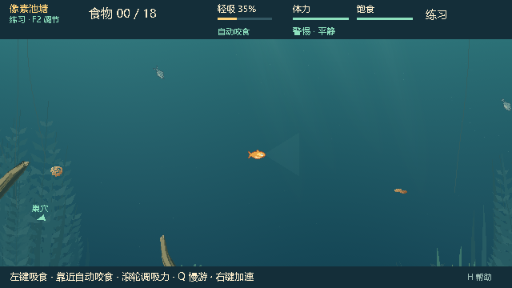

# 0.25.2：补充水域中部层次

状态：**IMPLEMENTED / WAITING_FOR_PLAYTEST**。用户认可 0.25.1 的视觉方向，反馈截图中间偏空；本轮完成中央背景调整及新本地包，等待复看。

## 画面调整

- 把部分原来集中于两侧的远景草丛错落分布到中部，设置不同高度、倾斜方向与较低对比度；靠后的位置和较淡颜色保留鱼、食物及鱼线的可读性。
- 斜射光深度由 220–355 px 调整为 290–410 px，强度由 0.045–0.095 调整为 0.08–0.115。光影更深入水体，不增加类似食物的亮颗粒。
- 沿用 713284 及原构图风格；复用原有装饰预算，仍为 18 处动画、7 张纹理。中部的部分草茎沿用轻微摆动，没有增加逐帧生成。
- 只改变生成背景。地图、碰撞、食物、NPC、摄食、鱼线及网络权限保持不变；开关、默认关闭和本次启动有效的行为不变。

| 0.25.1 同镜头 | 0.25.2 同镜头 |
|---|---|
|  |  |

## 代码与验证范围

基线 `e03993a33af0dc2f4a69b02cae4abbb838c404ef`；本轮运行代码 `a318e3b9d22dcec1637df29dd5fed842b996041f`。修改集中在 `water_atmosphere.gd`、`water_dynamic_generator.gd` 和 `forest_pond_atmosphere.json`；其他三个生产脚本只同步版本号 0.25.2。项目、构建目录及当前试玩文档同步更新。

生成器仍为 `wg-2.1`，构图修订 `wg-2.1.1`；`raster_spec` 更新为 `rgba8-midwater-groves-atlas-v3`，确保旧缓存不会复用。公开地图摘要仍为 `ce6bd84149877c461f1765497b7aa7b58fe8e80abf74965e45b406824ac31b1d`。

Windows / Godot 4.7.2 stable official `ed1daf0bf001b61586d9930840f2f1394092c079` / GL Compatibility / AMD Radeon(TM) Graphics。测试用户目录隔离，音频 Dummy。完整命令、实际测试 commit、dirty diff SHA-256、原始采样和包内摘要见 [本轮审计](evidence/wg3-center-audit.json)。原始产物保存在 `artifacts/watergen/wg3-center-*`。

| 执行范围 | 套件 / 断言 | 结果 |
|---|---:|---|
| 源码集成与原生画面 | 2 / 108 | PASS；完整状态、RNG、960 个实际绘制 tick、暂停/回退/角色限制、5 个镜头及 HUD |
| 私有氛围契约 | 1 / 49 | PASS；四种子确定性、预算、动画锚点、像素重现、随机流隔离、公开输入不变 |
| 三类饵、自动咬食、木头淡出、解缠 | 4 / 124 | PASS；原有原生测试开启新环境运行 |
| 联机规则、NPC 信息权限 | 2 / 235 | PASS |
| 实际 PCK 集成与原生画面 | 2 / 108 | PASS；干净的 a318e3b |
| PCK 清单、视觉身份、实际 EXE | 3 个探针 + 2 次启动 | PASS |

源码两组测试发生在提交前，均记录 `e03993a + dirty diff 08fb6079df9d8c2d6dce29d3b5da341724e6cbd02b55323e67da13d51f7d5c57`；运行前后源码摘要一致，已核对测试中的生产代码、profile、项目配置与 a318e3b 相同。PCK 测试在干净的 a318e3b 上完成。后续只补交付文档、图片和历史索引。

73 个包内代码/场景/配置与源码 SHA-256 一致，生成计划和六层 RGBA 摘要一致；31 张对应原生截图全部逐像素相同。ZIP 内四个文件也与解压目录逐一校验。tests/tools/预览场景未装入发行 PCK。

本轮为纯背景调整，运行上述针对性回归，没有重跑 0.25.1 的完整 52 组 current 和 21 组 native，也没有重做大规模玩法平衡实验。此前完整接入结果保留于 [WG3_REPORT.md](WG3_REPORT.md)，不算作本轮重新执行。

## 成本与交付

PCK 首次准备约 **0.742 秒**（计划 6.610 ms、烘焙 731.744 ms、上传 API 3.994 ms）。60 帧预热后各采样 180 次：旧环境 / 新环境生产 `_draw()` CPU 提交 p95 为 **2.698 / 3.062 ms**，增量 0.364 ms。20 次重开/开关切换未重复烘焙或上传，纹理数保持 7。该指标不是 GPU 完成时间，也不是实际游戏恒定帧率保证；显存未单独测量。

运行 `E:\Fish_catches_people\aquatic_system\Releases\BaitbreakPixel-0.25.2\BaitbreakPixel.exe`，在设置中打开「蕨叶水域 · 本地小鱼视角」。关闭开关可即时对照原环境，原 0.25.1 包保留。双方联机需使用同一版本；本轮没有发布新的 GitHub Release。

| 文件 | 字节 | SHA-256 |
|---|---:|---|
| BaitbreakPixel.pck | 2341240 | `3e8577a9087958a1f20dce0cd318f78266c75deca9998e9e386de7d1d1a1c8e8` |
| BaitbreakPixel-0.25.2.zip | 89619327 | `8ed2107f497f50f93894fd79aa8b5917ef974e201d2b803a56cc6e449ca09c49` |

用户反馈记入 WG-PF-304：方向认可，中央偏空。本轮停止于新画面待复看；不将此次认可扩展为所有可读性条目或后续玩法阶段的批准。
