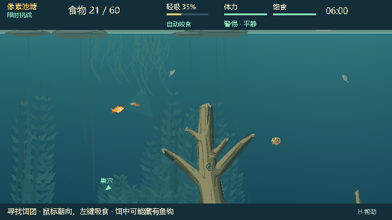

# WG-3：0.25.1 可选水域试玩交付

状态：**IMPLEMENTED / WAITING_FOR_PLAYTEST**。Windows 本地包已生成并验证；人工可读性、视觉喜好和操作体验等待用户试玩。没有发布新的 GitHub Release。

## 本轮范围与证据基线

2026-10-03 用户明确回复「可接入试玩」，本轮按 WG-3 接入此前选定的 713284 蕨叶庭。此前 WG-2.1 报告中的“不接入”保留为历史状态。本轮批准不等于所有视觉项或环境鱼 P3.2 已获人工确认。

- 集成基线：`c1e3946f0b8cf1afa7becf2b238c8297efda5dc8`（0.25.0）；归档保存在 `artifacts/watergen/wg3-baseline/source-c1e3946.zip`。合入工作分支的提交为 `415dc5050d10829d860cb98e2dd617cd230badc7`。
- 生产适配：`cc972ac`；新增验证和注册：`fda5d9bd484b57d2a09fb3b297ee8eba69eb1e10`；最终打包源码：`64c87bc4a189e6459c8834a8d3d4fdb52558b015`。后续交付只补文档、证据和本地版本索引。
- 完整 headless 在干净的 `fda5d9b` 上运行；native、generated 和 PCK 套件在干净的 `64c87bc` 上运行。两者生产脚本、场景、profile 和项目配置 SHA-256 相同；变化仅为原生测试的菜单层级、私有 wrapper 和导出排除预览场景。所有正式运行前后源码摘要一致。
- Windows；Godot `4.7.2-stable (official)` / `ed1daf0bf001b61586d9930840f2f1394092c079`；GL Compatibility / OpenGL 3.3；AMD Radeon(TM) Graphics，Ryzen 7 7735H。原生画面 640×360，Dummy 音频。

完整命令、套件名、断言计数、截图 RGBA 摘要、日志哈希和包体数据见 [审计记录](evidence/wg3-audit.json)；按文档模板填写的 [run manifest](evidence/wg3-run-manifest.json) 和 [源码/PCK 绘制原始采样](evidence/wg3-frame-costs.json) 同步保存。原始日志及逐次 manifest 位于 `artifacts/watergen/wg3-*`，未覆盖开发期失败记录。

## 变更与边界

| 文件/区域 | 修改与约束 |
|---|---|
| `scripts/watergen/pond_water_appearance.gd` | GREEN 私有供应器；固定公开地图、profile 和视觉 seed，六层齐全才原子启用；失败整套回退 |
| `pond_view.gd` / `pond_scenery.gd` | YELLOW 共享绘制适配；只替换六个环境槽和床面裁剪槽，恢复原坐标变换 |
| `menu.gd` / `pond.gd` | YELLOW 设置开关及本地启动参数；只在设置或显式启动时准备，默认旧水域，本次启动有效 |
| `network_protocol.gd` | 仅 build `0.25.0 → 0.25.1`；VERSION、schema15、载荷和裁剪权限不变 |
| 项目/导出/试玩说明 | 同步版本 0.25.1；发行 PCK 包含所需 profile，排除 tests/tools 和 watergen 预览场景 |
| 两个新测试、注册表、私有 wrapper | 增加当前集成验证，不替换旧测试断言或黄金图；Windows 用户目录独立隔离 |

本 Agent 负责上述共享接口集成，授权来自用户本轮的明确回复。相对冻结的 0.25.0，原有 52 个生产 GDScript 中 47 个逐字节不变，另外 5 个正是上表的 menu、pond、view、scenery、network_protocol。没有修改 RED 范围的模拟、地图碰撞、输入命令、快照、信息白名单、摄食、NPC 或 RNG 规则。原主游戏检出未被覆盖。

只允许本地单人小鱼视角显示新版；岸上、抄网观察、共享会话及联网状态走原绘制路径。鱼、饵、鱼线、交互木石/草、实际水流粒子、岸缘、巢穴、网和 HUD 的调用顺序保留。时间来自原游戏 elapsed，暂停与重开遵从原语义；供应器不接收 world、私有状态或网络副本。

生成器 `wg-2.1`，profile `forest_pond_v1`，视觉 seed `713284`：

- 公开地图摘要前后均为 `ce6bd84149877c461f1765497b7aa7b58fe8e80abf74965e45b406824ac31b1d`。
- profile 规范化 SHA-256：`64ab73ec313938ec12a4135d40ac1e0b623180345015b0110a46e6dca5c542b0`；实际 JSON 文件 SHA-256：`892a5b34f67d2e93ec7e2c2b85c78a08081b22535e521b570c2180c1a9bd51ca`。
- ScenePlan 规范化 SHA-256：`8150c95dc7996cfd8a0ad5d4dfa580ed0aae3800c2bb61c165f25a50efc84f9b`。
- 源码和 PCK 的计划、缓存键、六层 RGBA 摘要完全一致，见 [视觉身份记录](evidence/wg3-visual-identity.json)。四种子独立构图仍见 WG-2.1；本轮生产接入固定 713284，没有扩大玩法配置。

## 自动验证

| 执行范围 | 套件 / 断言 | 结果与原始目录 |
|---|---:|---|
| 冻结 0.25.0 native | 20 / 523 | PASS，`wg3-baseline/native`；另有 import |
| 当前源码 headless | 52 / 237373 | PASS，`wg3-current-final`；另有 import |
| 默认旧水域 native | 21 / 599 | PASS，`wg3-native-final` |
| 新水域开启，原有 native | 20 / 523 | PASS，`wg3-generated-final` |
| PCK 新增集成套件 | 2 / 108 | PASS，`wg3-pack-focused` |
| PCK 新水域开启，原有 native | 20 / 523 | PASS，`wg3-pack-generated` |
| 固定鼠标的基线/当前复核 | 4 次套件执行 / 100 | PASS，26 张对应截图像素相同，`wg3-controlled-final` |
| 固定鼠标的源码/PCK观察复核 | 2 次 / 8 | PASS，2 张对应截图像素相同，`wg3-controlled-pack` |
| Python runner | 28 个单元测试 | 27 PASS，1 SKIP：Windows 不执行 POSIX 进程组检查 |
| 包内清单、生成身份和 EXE | 3 个审计探针及 2 个启动检查 | PASS，`wg3-delivery/pack-final` |

断言数来自各套件最终 summary；重复执行分别列出，不当作不同测试。import、EXE 标记和人工确认不计入断言总数。现行注册表共 113 个顶层入口；历史诊断和大规模平衡实验本轮未重跑，未把它们算作通过。

核心门禁对应如下：

- **WG-T01/T02/T03/T04**：WG-2.1 的完整契约和随机流测试保留原 SHA 与结果，本轮未重跑全部私有矩阵。新增集成检查拒绝未知字段、非字典和不完整 bundle，验证准备不修改权威状态；源码/PCK 生成的完整计划及六层摘要相同。不能把上述集成断言记为本轮完整 T04 重测。
- **WG-T05/T06**：地图摘要不变；同一完整初态、同指令下对照 960 个实际绘制 tick。包含 survival/duel 各 240，摄食、缠线解缠、抄网各 160；逐 tick 比较完整快照与全部 RNG，不忽略 target_opacity、elapsed、统计或 NPC。到达钩接触/附着、QTE、补饵、去重摄入、解缠和实际抄网捕获。部分状态由测试夹具到达，不称为人工完整对局。
- **WG-T07/T14**：仅改变隐藏钩真值、身份和模拟随机种子，环境键/六层像素及最终鱼端画面相同；现有信息裁剪、ENet、NPC 公共投影回归通过。水域没有进入网络载荷。
- **WG-T08/T09**：五个边缘/中间镜头、三类饵、吸食、警惕、缠线、整木淡出、抄网和岸上等生产夹具运行并截图；输入坐标往返不变，顶部及底部 HUD 的非环境像素精确相同。实际生产镜头中点为 `(320,47)`，另有 `(0,0)`、`(640,120)`、`(0,120)`、`(640,0)`；WG-2.1 的 `(320,60)` 等固定预览仍保留。
- **WG-T11/T12**：实际暂停冻结水域像素；20 次重开/切换不增加烘焙或上传；换角色、联机资格、无效配置及部分图层均验证，回退后的整幅旧画面相同。
- **WG-T13/T15**：current/native 和独立包结果见上表；73 个包内代码、场景、配置文件与源码 SHA-256 相同，profile 存在，tests/tools/预览场景不存在。实际 EXE 标题页为 0.25.1，新水域捕获成功。
- **WG-T10/T16**：自动场景已生成，最终食物辨识与人工美术确认仍为 **NOT_RUN / WAITING_FOR_PLAYTEST**。

没有放宽旧图像要求：旧基线 234 张截图中 227 张直接相同，2 张差异为版本文字和新设置项，另外 5 张来自旧夹具读取当前 OS 鼠标，影响观察准星/朝向。使用同一固定指针夹具在两份冻结源码上复核，两套的 26 张图全部相同。源码/PCK 的 265 张对应图中 263 张直接相同，另外 2 张同为观察准星位置，固定指针后相同。原始差异和精确边界均保留在审计记录，没有做全图豁免或掩码。

开发期发现并修复的验证问题：初始工作树缺主线资源导入；HUD 夹具曾把底栏上方 6 行水体计入 UI；计时 View 的替换曾漏恢复菜单兄弟顺序；外部包清单探针曾遗漏 bool 类型注解。原记录在 `wg3-dev-01/02/03` 和 `wg3-delivery/pack-inspection.log`，最终运行无引擎错误。上述均为资源导入或测试探针问题，没有通过改碰撞/玩法来解决。

## 画面与性能

实际独立 EXE：

设置入口见 [设置截图](images/wg3-settings.png)，缠线及木头淡出见 [交互截图](images/wg3-wrapping.png)。完整实际场景在 `wg3-native-final/captures`、`wg3-generated-final/captures` 及对应 PCK 目录。

每模式预热 60 帧，测量 180 次生产 `_draw()` CPU 提交；源码/PCK 分别运行，期间未并行构建或同步主线。

| 测量 | 源码 | PCK |
|---|---:|---:|
| 首次 ScenePlan | 6.406 ms | 6.576 ms |
| 首次 Image 烘焙 | 731.713 ms | 726.661 ms |
| 首次纹理 API 上传 | 26.644 ms | 27.710 ms |
| 总首次准备 | 764.763 ms | 760.947 ms |
| legacy draw CPU 中位 / p95 | 2.385 / 2.824 ms | 2.368 / 2.923 ms |
| generated draw CPU 中位 / p95 | 2.680 / 3.183 ms | 2.556 / 3.101 ms |
| draw CPU p95 增量 | +0.359 ms | +0.178 ms |
| legacy / generated 帧间隔 p95 | 34.994 / 35.525 ms | 34.934 / 35.262 ms |

帧间隔包含测试的帧等待、显示节奏和系统调度；CPU 计时不等于 GPU 完成时间，也不能据此宣布实际游戏恒定 60 FPS。首次准备发生在设置页/显式启动，实际游动不生成；复用时不再烘焙或上传。两次最终采样都保留 7 张纹理（六层及一个 18 动画图集），反复开关/重开没有增加。CPU Image/plan 不保留在生产供应器中；本轮没有独立测量显存或长时间运行内存，WG-2.1 多 seed 缓存压力记录保留其原始范围。

## 本地包与回退

目录：`E:\Fish_catches_people\aquatic_system\Releases\BaitbreakPixel-0.25.1`。双击 `BaitbreakPixel.exe`，进入「设置 → 蕨叶水域 · 本地小鱼视角」，再开始本地小鱼挑战或练习；也可加应用参数 `-- --water-appearance=fern`。默认关闭，本次启动有效；关闭即可立刻回到原水域，不修改存档、规则或 Git 历史。联机双方需同为 0.25.1。

| 文件 | 字节 | SHA-256 |
|---|---:|---|
| BaitbreakPixel.pck | 2340488 | `a7d7195c19e065e353f323faab97b6b999de8caaecd7afa506bce1bf67ed16d4` |
| BaitbreakPixel.exe | 180858888 | `ab1824f85bfd8e0e4128182c000c4003a3e042245b2967848d089b2a04b22424` |
| BaitbreakPixel-0.25.1.zip | 89618969 | `c1d544982899ca6334a9529bc018b34d1060a5458bfcd1b3115b706c36d52a14` |

公开下载仍为 0.25.0；本轮包、源代码推送与 GitHub Release 分开记录。没有覆盖旧包或原游戏工作树。

## 人工验收与停止点

用户已选定 seed 713284 并允许接入；尚无本轮 WG-PF 最终确认。请按 [反馈记录](WG3_PLAYTEST_FEEDBACK.md) 记录食物误识别、细线/绕行/QTE 遮挡、装饰看似碰撞物、明显卡顿，以及位置、角色和是否只在新版水域出现。自动测试没有替代这些判断。

本轮停止于 **WAITING_FOR_PLAYTEST**。可依据用户试玩反馈继续修视觉问题；未擅自扩展岸上/联网环境，未开展 P3.2 抢食、多竿、规则或地图几何重构。真实声卡听感、跨平台 GPU 表现和跨机器网络本轮未单独验证。
