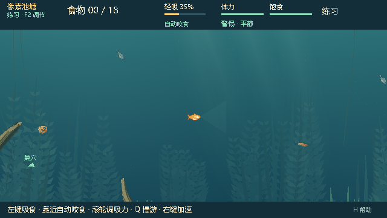
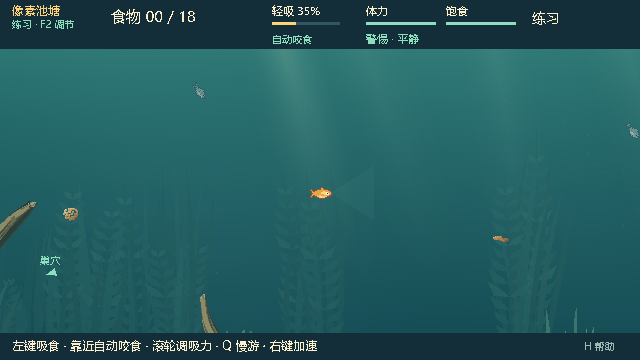
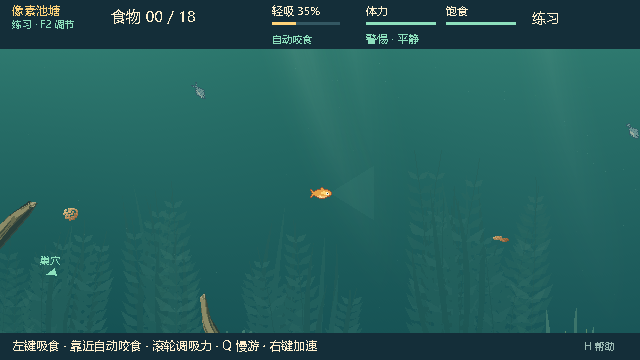
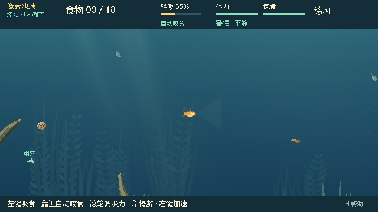
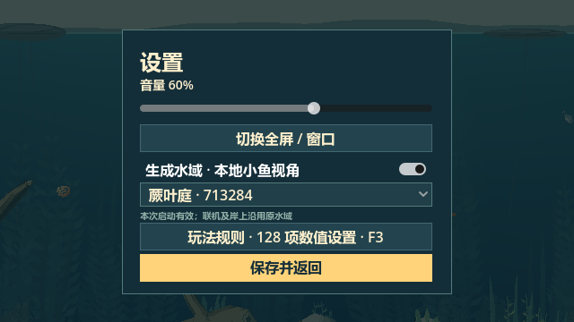

# 0.25.3：四种水域构图可切换

状态：**IMPLEMENTED / WAITING_FOR_PLAYTEST**。用户选择「四种水域构图可切换」，已完成本地设置、独立 Windows 包和验证。此前 0.25.2 中部调整 WG-PF-304 已获确认；本轮新增选择体验等待实际试玩反馈。

## 使用与范围

打开设置中的「生成水域 · 本地小鱼视角」，在下拉框选择蕨叶庭 713284、长叶湾 2649、浮叶荫 42 或垂根岸 731。默认选择仍为 713284，开关默认关闭；同次启动内重开对局保留选择。关闭时先选构图不会生成图层，打开时才准备。最近两套构图复用缓存，其他构图重新准备；失败完整回退并恢复选择。

四种构图只影响本地小鱼视角。碰撞、摄食、鱼线、NPC、世界 RNG、快照 schema15、隐藏信息与原有绘制顺序保持不变。联机时两个控件禁用，岸上和抄网观察沿用原环境。完整操作见 [WG4_README.md](WG4_README.md)。

| 蕨叶庭 · 713284 | 长叶湾 · 2649 |
|---|---|
|  |  |
| 浮叶荫 · 42 | 垂根岸 · 731 |
|  |  |

## 基线与验证

开发基线 `83d6ca5724a9241399b3e4aa5dbf03e3f2017b10`；运行代码 `c7e24e1ef163820b06b4b013a1c9db6ef221b6b3`。沿用用户刚确认的 0.25.2 水域及底层 P3.0/P3.1 玩法。已核对主线 `origin/feature/dev @ 5e04115c8bad9861935b18045d2ffd4dc2b59388` 的 P3.2 NPC 觅食变化，本轮未合入；这是明确保留的玩法同步缺口。本地水域包不等同于主线公开 0.25.1 觅食版。

Windows / Godot 4.7.2 stable official `ed1daf0bf001b61586d9930840f2f1394092c079` / GL Compatibility / AMD Radeon(TM) Graphics；隔离测试用户目录，Dummy 音频。完整命令、实际测试 commit、源码/日志摘要、包内清单与统计见 [审计记录](evidence/wg4-audit.json)，日志文本归档于同目录 `wg4-*.txt`（统一 LF 换行并去掉一处空字段尾随空格，原始字节与归档文本分别记录摘要）。本轮复用 `run_wg3.py` 运行入口，其旧 task_id 和地图基线不代表 WG-4 的开发基线。

| 执行范围 | 结果 |
|---|---|
| 源码集成契约与原生画面 | 43 + 90 条断言通过 |
| 独立 PCK 集成契约与原生画面 | 43 + 90 条断言通过 |
| 菜单、规则、NPC 信息权限及四种构图下的饵料原生检查 | 8 次执行通过：555 条汇总断言，另有 2 个菜单完成 PASS 标记 |
| 包资源、源码/PCK 视觉身份探针 | 3 个探针通过 |
| 实际 EXE 启动 | 默认菜单、四种构图、legacy、无效名称，共 7 次通过 |

覆盖实际设置控件信号、四种画面差异、关闭时延迟生成、无效选择、生成失败恢复、20 次切换后的缓存上限及驱逐后确定性。960 个实际绘制 tick 在四种构图中循环，并分别验证摄食、缠线和抄网事件后的完整状态/RNG 等价。保留五镜头、HUD、隐藏钩像素、暂停、重开和角色限制验证。

源码测试在提交前的 `83d6ca5 + dirty diff` 上运行；审计保留精确 diff 摘要，测试前后源码一致，运行代码和测试文件摘要与 c7e24e1 一致。PCK 测试在干净的 c7e24e1 上通过。私有回归包装器起初误将不输出 `passed/failed` 汇总的旧 `visuals.gd` 判为失败；引擎退出码为 0，原始日志有真实点击和完成标记。随后按项目通用 `run_tests.py::classify` 重新分类，原始失败 manifest 和修正说明均保留，未改写日志或跳过错误。

73 个包内代码/场景/配置 SHA-256 与源码一致，默认生成计划与各图层 RGBA 身份一致。四种构图和设置页均与源码截图逐像素相同；35 张对照截图中 33 张完全相同。两张抄网观察截图的 A 标记受系统鼠标位置影响，跨运行位置不同；每次运行内部关闭/开启生成水域的观察截图仍完全一致。默认 713284 对局画面与 0.25.2 逐像素一致。ZIP 四个文件与构建目录逐一校验，PCK 排除了测试、工具和预览场景。

本轮采用针对性回归，未重新执行完整 current/native 注册表或平衡实验；不将此前版本结果计入本轮通过数。

## 准备时间与缓存

四种构图首次准备（计划 + 烘焙 + 上传 API）在源码为 0.69–0.73 秒，独立包为 0.77–0.89 秒；发生于设置或显式启动参数处理时。最近两种复用缓存无需新上传。20 次轮换后，弱引用检查证实最多两套驻留 bundle、14 张存活纹理；日志 `cache_counts` 是累计创建次数，不是驻留内存。

默认蕨叶庭每组预热 60 帧、采样 180 帧。独立包旧/新水域 `_draw` CPU 提交中位数为 3.262 / 3.287 ms，P95 为 4.830 / 4.991 ms；帧间隔中位数为 16.777 / 16.699 ms。该测量包含调度与帧率限制，CPU 提交并非 GPU 执行时间，也不是所有设备的性能保证。原始采样见 [源码](evidence/wg4-source-frame-costs.json) 与 [独立包](evidence/wg4-pack-frame-costs.json)。

## 本地包与后续反馈

目录：`E:\Fish_catches_people\aquatic_system\Releases\BaitbreakPixel-0.25.3`；同级 ZIP：`BaitbreakPixel-0.25.3.zip`。保留既有版本，本轮未创建 GitHub Release。

| 文件 | 字节数 | SHA-256 |
|---|---:|---|
| BaitbreakPixel.pck | 2,343,592 | `d9da1b8fb8516874cb5c619a002202d88c6c501492a7ab461f5bdf12f442e02e` |
| BaitbreakPixel-0.25.3.zip | 89,620,167 | `f393425be09b7c89b5e49f522d04f54c2e49f4a68da2df62b7420cc9663325ab` |

人工检查：四种构图是否易辨认，切换时等待是否可接受，连续游动时食物/鱼线是否清楚。记录位置、构图名称与操作步骤；自动验证不替代视觉体验确认。见 [WG-4 反馈记录](WG4_PLAYTEST_FEEDBACK.md)。
