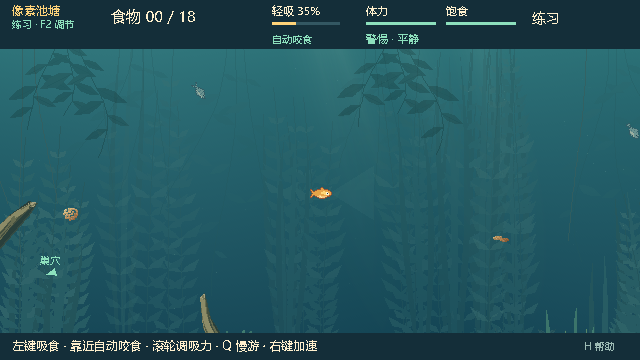
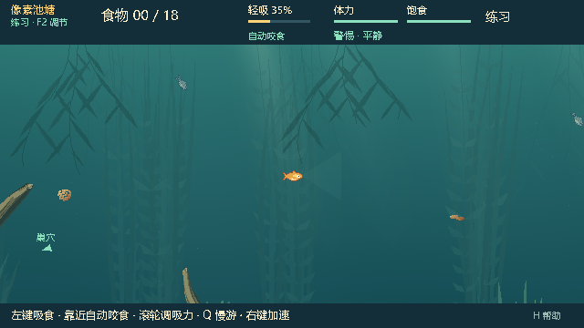
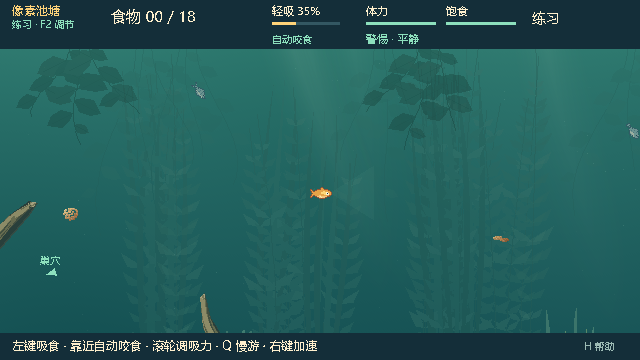
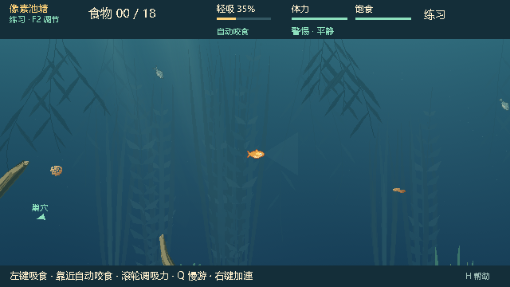

# 0.25.4：补充四种构图的中上层近远景

用户反馈四种构图中部偏上都较空，希望增加近远景。本轮延续四种构图和默认种子 713284，集中补充该区域的层次；新画面等待用户复看，反馈编号 WG-PF-404。

## 画面调整

- 中部远景草丛的主高度范围由 170–275 px 提升到 310–395 px，枝叶高度更接近主高度，让轮廓延伸到水体中上层；保留较低对比度和错落分布。
- 将一部分既有远景草丛预算换成水面悬垂叶簇，补充从上向下的轮廓；将两处既有前景草丛换成更大的近景叶簇，与远景使用不同视差。
- 蕨叶庭使用较宽叶片，长叶湾使用细长叶片，浮叶荫使用更宽、更短的叶簇，垂根岸保留更长的下垂轮廓。分枝长度、弯曲、叶片附着位置与左右方向错开，避免网格般的重复排列。
- 悬垂叶簇顶部固定、下端轻微摆动。仍为 18 处装饰动画、六层纹理加一张动画图集；不增加逐帧生成。纹理张数不变，图集尺寸随新轮廓调整。

没有新增碰撞或交互植物。鱼、食物、鱼线和玩法状态保持不变；生成水域仍只作用于本地小鱼视角，默认关闭，联机/岸上/抄网观察保持原环境。

| 0.25.3 | 0.25.4 |
|---|---|
|  |  |
|  |  |
|  |  |
|  |  |

## 实现与验证

开发基线为 `5d6e969cbe0a16524925b9472ae06d65a0957377`（0.25.3）。修改私有 `water_atmosphere.gd`、`water_foliage.gd` 和 dynamic baker/generator；共享菜单、入口、网络脚本仅同步版本号。profile、公开地图摘要、权威模拟、RNG、角色信息权限和绘制顺序不变。底层仍为既有 P3.0/P3.1，没有合入主线新增觅食玩法。

构图修订更新为 `wg-2.1.2`，栅格签名为 `rgba8-upper-canopies-atlas-v4`，使旧图层缓存失效。新增裁切测试将整幅叶簇与动画小图回填后的像素逐一比较：初次发现三种子存在边缘取整差异，已通过先量化局部像素坐标再平移修复，保留原始失败日志。复验不放宽像素相等条件。

验证环境：Windows / Godot 4.7.2 stable official / GL Compatibility / AMD Radeon(TM) Graphics；隔离测试用户目录、Dummy 音频。采用本次改动相关的针对性回归，未重跑完整测试注册表或平衡实验。实际源码提交、命令、日志、原始采样及包体摘要见 [本轮审计](evidence/wg4-upper-audit.json)。

## 试玩

本地目录为 `E:\Fish_catches_people\aquatic_system\Releases\BaitbreakPixel-0.25.4`，同级 ZIP 为 `BaitbreakPixel-0.25.4.zip`。设置中打开「生成水域 · 本地小鱼视角」，可用下拉框切换四种构图。沿用默认选择 713284 和最近两种构图缓存。本轮不发布 GitHub Release。

人工复看重点：中上层是否仍显空旷，近景叶片是否过密，连续游动时食物与鱼线是否清楚。自动通过不替代这些视觉体验反馈。

## 交付核验

运行代码 `476de4c5d50e5c69d645484a24ee6f666eed7eb7`。源码最终集成/原生画面 43 + 90 条断言通过；氛围契约 57 条、四种构图下三类食物检查 4 × 78 条通过。独立 PCK 集成/原生画面 43 + 90 条通过；3 个资源/视觉身份探针和 7 次真实 EXE 启动（默认、四构图、legacy、无效参数）通过。

覆盖设置、20 次构图切换、两套缓存及最多 14 张存活纹理、确定性、叶片完整裁切、图集像素、摆动锚点、五镜头/HUD、暂停、重开、隐藏钩信息和 960 个实际绘制 tick 的完整权威/RNG 等价。新叶簇复用既有预算，零植被预算也保持有效。

源码测试在提交前运行，开始/结束源码摘要一致，相关运行代码与测试摘要已核对为 476de4c；独立包测试开始时是干净的 476de4c，运行代码在测试期间未变。使用既有 WG-3 wrapper 的旧 task_id 仅是运行入口，不代表本次开发基线。

73 个包内代码/场景/配置与源码 SHA-256 一致。四种构图的原生画面与源码逐像素一致；全部 35 张对应截图一致；各次运行内旧/新环境的抄网观察画面也完全相同。ZIP 内四个文件与构建目录逐一一致，包内试玩说明也与当前文档一致。

本机首次准备源码约 1.49–1.62 秒，独立包约 0.89–1.65 秒；最近两种缓存复用。独立包旧/新水域绘制 CPU 提交中位数 2.749/3.050 ms，P95 3.915/4.382 ms。每组预热 60 帧、采样 180 帧，CPU 提交不代表 GPU 耗时，帧间隔受调度和帧率限制影响；不据此声称所有设备性能一致。

| 文件 | 字节数 | SHA-256 |
|---|---:|---|
| BaitbreakPixel.pck | 2,347,960 | `e269c0ab0930d944bd916997e0b95995218e80325042d30ef8e92d5c878beda8` |
| BaitbreakPixel-0.25.4.zip | 89,620,210 | `7bd2357f32cc1507aa3132e86e6c4ec3ef26b9acf6e5ba0201bbfbb77199e79d` |
