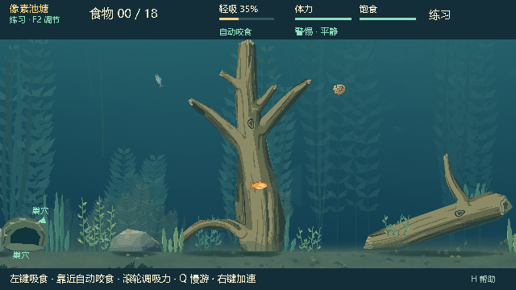
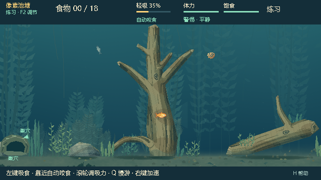
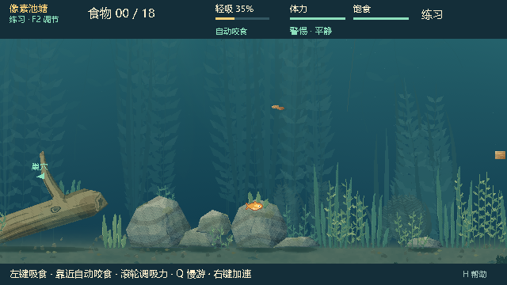
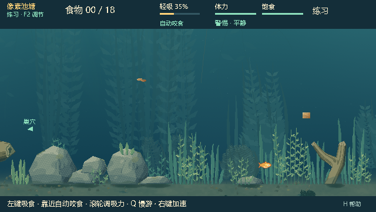
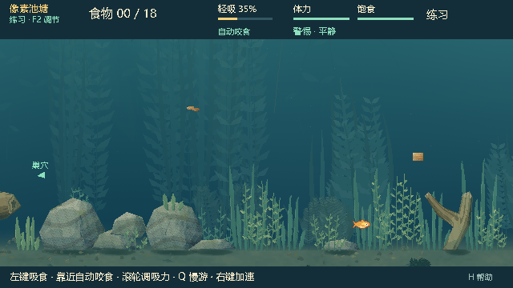

# 0.25.5：木石与水草材质细化

在用户确认的 0.25.4 水域构图上，为已有木石与交互水草补充表面细节。木头增加树皮色差和附着藻层，石块增加矿物条带与斑点，水草增加根部到叶面的明暗变化。四种构图、默认种子 713284 和中上层近远景保持原样。

打开「生成水域 · 本地小鱼视角」即可启用；关闭即时恢复原画面。图像轮廓、碰撞、统一淡出、缠线、食物、NPC 和联网规则保持不变。使用及开发范围见 [WG-5 说明](WG5_README.md)，新材质观感待 [人工反馈](WG5_PLAYTEST_FEEDBACK.md)。

## 同场景对照

以下在固定种子、同一镜头及相同游戏状态下，分别绘制原材质与增强材质；水域图层一致。

| 原材质 | 0.25.5 增强材质 |
|---|---|
|  |  |
|  |  |
|  |  |

## 实现与检查

开发基线为 `fd8c5340033aa4846517813fff4bbd0b3ad7d221`，运行代码为 `05fcb3339e1622ebd10ef1fb7c2a04f8e0a7d05f`。只在生成水域启用时，给原始公开纹理增加 RGB 材质处理。保留每个像素的 alpha、裁切原点、木头组合成员、植物全部八帧姿态和原绘制次序；不读取权威状态或玩法 RNG。上游已核对至 `6a2f124`，后续 NPC 觅食和社交行为未合入。

检查环境为 Windows / Godot 4.7.2 stable official / GL Compatibility / AMD Radeon(TM) Graphics。测试采用隔离用户目录和 Dummy 音频。

| 检查 | 结果 |
|---|---|
| 源码集成与原生窗口 | 43 + 93 条通过 |
| 新材质契约，源码及独立 PCK | 各 61 条通过；alpha、位置、成员、确定性、复用、释放 |
| 原植物姿态与绑定 | plant_art 16,579 条、grass_binding 70 条通过 |
| 增强材质下木头交界处透明 / 三类食物 | 原生 17 / 78 条通过，使用蕨叶庭 |
| 同场景材质对照捕获 | 8 张成功 |
| 独立 PCK 集成与原生窗口 | 43 + 93 条通过 |
| 包资源与实际启动 | 74 个代码/场景/配置摘要相同；3 个探针、7 次 EXE 启动通过 |

集成检查覆盖四种构图、20 次重开与开关、材质懒准备与复用、五处镜头/HUD、暂停、失败回退、角色限制、隐藏钩信息及 960 个实际绘制 tick 的完整权威/RNG 等价。源码正式测试前后摘要一致，已核对全部被测源码与运行提交一致；PCK 测试从该干净提交开始。未重跑全部历史注册表或玩法平衡实验。

与 0.25.4 相比，源码的 12 张原环境/角色/回退截图逐像素一致。源码与 PCK 的 35 张截图中 33 张完全相同；两张抄网观察截图各有 228 个像素不同，位于实时鼠标的 A 标记与圆圈区域（包测试时鼠标在交互区内，源码时在外）。观察界面仍使用原材质，且源码与 PCK 各自的开关前后观察截图都完全相同。保留差异记录，不将这两张计为跨运行逐像素通过。

完整命令、提交、源码摘要、结果、日志索引和采样见 [审计记录](evidence/wg5-audit.json)。原 WG-3 wrapper 的 task_id 仅标识复用的检查入口，本轮开发任务为 WG-5。

## 准备与绘制成本

材质仅准备一份，共 11 张木石组合纹理和 176 张植物帧纹理，四构图共享。额外 RGBA 像素为 3,099,856 字节（约 2.96 MiB），另计在最多 14 张环境缓存纹理之外；不含驱动开销，也不是实际显存测量。关闭开关时保留缓存便于再开启，所属 View 释放时纹理可释放。

本机源码首次材质准备 0.388 秒，独立包 0.330 秒；同期默认环境准备分别约 0.786 / 0.813 秒，两部分顺序执行。独立包原/增强水域绘制 CPU 提交中位数 3.353 / 3.953 ms，P95 为 4.123 / 4.595 ms。各预热 60 帧、采样 180 帧；CPU 提交不代表 GPU 耗时，测试结果受本机调度影响。

## 本地试玩包

目录：`E:\Fish_catches_people\aquatic_system\Releases\BaitbreakPixel-0.25.5`；ZIP 位于同级。解压运行 `BaitbreakPixel.exe`，菜单核对 0.25.5。ZIP CRC 及四个文件与构建目录一致，包内试玩说明与当前文档一致。本轮未发布 GitHub Release。

| 文件 | 字节数 | SHA-256 |
|---|---:|---|
| BaitbreakPixel.pck | 2,352,124 | `cb07065c0f89dc103cf7626e9f01c29770447dd48bdd3c00ced8662737a5cb9b` |
| BaitbreakPixel-0.25.5.zip | 89,623,763 | `7aa21bf7bd7f80909c888bee3e9951eda04756b4f792b69098e38cdf772e362f` |
