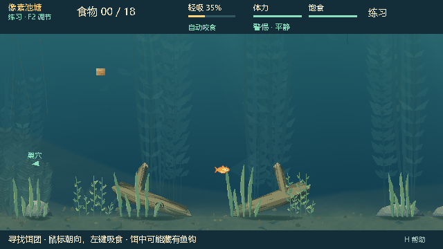
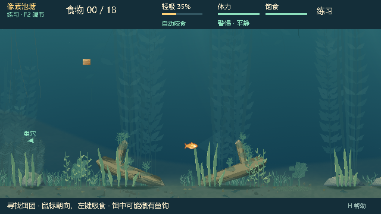
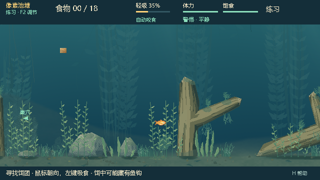

# WG-6.2 植物群落交付记录

日期：2026-10-05。新分支 `feature/watergen-v2`，起点 `feature/dev@c3c24b3`。第一代 `feature/watergen@63112b1` 保持不变。

本轮实现六类纯视觉植物及独立预览。群落使用真实 MapContext 导出的公开表面，按石面、木枝、草丛边缘和池底空隙布置。新增模块没有进入正式 Main/PondView 的依赖路径，游戏版本保持 0.27.5。本轮不发布试玩包。

## 结果与边界

- 苔藻像素裁切在真实木石多边形内；木枝附生植物随整木透明度一起淡出。
- 丝状藻、矮草和宽叶草轻微摆动，根部固定，动画使用显式视觉时间。
- 地毯藻沿真实池底生长，低/中/高密度与独立视觉种子可在预览切换。
- 保留出生、巢穴、候选饵点和中央视野留白。没有新增碰撞、食物、缠线目标、阻力或 NPC 行为。
- 真实游戏截图通过开发专用 View 子类复用当前鱼、食物、NPC、HUD 渲染；正式视图文件没有修改。

## 自动验证

完整运行目录：`artifacts/watergen/wg62-review`。记录基线 HEAD 及当时未提交的新文件；验证完成后只整理文档与证据，没有再次改变被测 GDScript。

| 检查 | 结果 | 主要覆盖 |
|---|---:|---|
| Godot 导入 | PASS | 所有新增脚本、场景解析 |
| 群落契约 | 81 / 81 | 六个真实地图种子、公开挂点、纯值、确定性、密度、苔藻裁切、RGBA、玩法状态 |
| 原生独立预览 | 206 / 206 | 四地图、四模式、整世界和五镜头、暂停/跳时、遮挡淡出、缓存、移动镜头 |
| 真实游戏视图 | 49 / 49 | 地图 42 / 1346、开启/关闭群落、重复帧、低饱食 HUD、岸上视角、经典地图 |
| 合计 | **336 / 336** | 0 失败、0 超时 |

契约测试的两套真实 World 使用相同输入推进 1,800 tick，其中一套期间生成不同密度与视觉种子的植物；逐 tick 完整 snapshot 相同，包括 world/NPC RNG、分数、钩、缠绕及抄网状态。地图目标顺序、障碍、阻力区、饵位和来源保持不变。现有气氛随机流未受新增植物影响。

产出 111 张 PNG：98 张独立预览及 13 张真实游戏视图。随提交保留代表截图和测试日志；全部截图与可切换对照在[本机画廊](../../artifacts/watergen/wg62-review/gallery.html)，运行方法见[使用说明](WG62_README.md)。

原始功能记录：[契约](evidence/contract.txt)、[原生预览](evidence/native.txt)、[真实游戏](evidence/gameplay-native.txt)、[运行结果](evidence/run-results.json)、[计时](evidence/native-results.json)。

## 本机性能

Godot 4.7.2 stable / gl_compatibility / AMD Radeon(TM) Graphics。下表仅为新增植物的 plan + bake + texture upload，不含已有环境首次准备耗时，也不是整局 FPS。

| 真实地图种子 | 群落 / 植物块 | 单张图集 | 首次准备 |
|---|---:|---:|---:|
| 42 | 20 / 67 | 1024 × 148 | 20.106 ms |
| 2166 | 18 / 51 | 1024 × 172 | 17.211 ms |
| 1346 | 21 / 62 | 1024 × 152 | 18.484 ms |
| 296 | 19 / 62 | 1024 × 152 | 19.653 ms |

独立预览绘制命令的 CPU 中位数 0.791 ms、P95 0.977 ms，不能替代正式游戏性能测试。连续 180 个移动镜头帧没有新增 bake/upload；热缓存复用通过；缓存最多保留两张植物图集。

## 代表画面

默认地图，使用当前游戏渲染器：

| 基线 | 新增群落 |
|---|---|
|  |  |

密集地图：

| 基线 | 新增群落 |
|---|---|
|  |  |

隐藏旧远景装饰后的真实地形与植物：[42](evidence/plants-42.png)、[2166](evidence/plants-2166.png)、[1346](evidence/plants-1346.png)、[296](evidence/plants-296.png)。另有[木石完全淡出](evidence/attached-cover-fade.png)和[公开挂点](evidence/public-anchors.png)。

## 视觉评审状态

已检查代表截图中的表面贴合、普通游动及低饱食 HUD。尚未获得用户对此版植物密度、形态与动态观感的确认。没有将人工项标为 CONFIRMED。

| 项目 | 状态 |
|---|---|
| WG-PF-602 植物密度丰富但不杂乱 | WAITING_FOR_PLAYTEST |
| WG-PF-605 食物、鱼线、QTE 可读性 | OPEN；已捕获普通游戏视图，未专门覆盖所有食物、缠线、抄网预警和 QTE 组合 |
| WG-PF-606 连续游动是否明显卡顿 | WAITING_FOR_PLAYTEST；自动缓存/移动帧检查已通过 |

本轮未重跑 dev 的千局地图发行验收，也没有进行联机或发布包验证；已有生产代码没有变化。动物与真实生态行为不属于本次范围。
