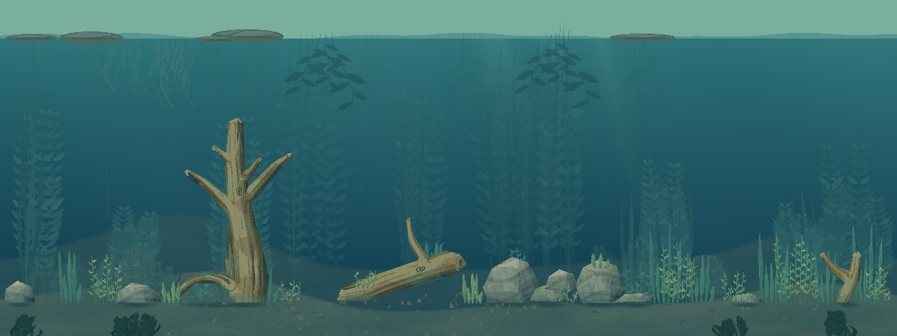
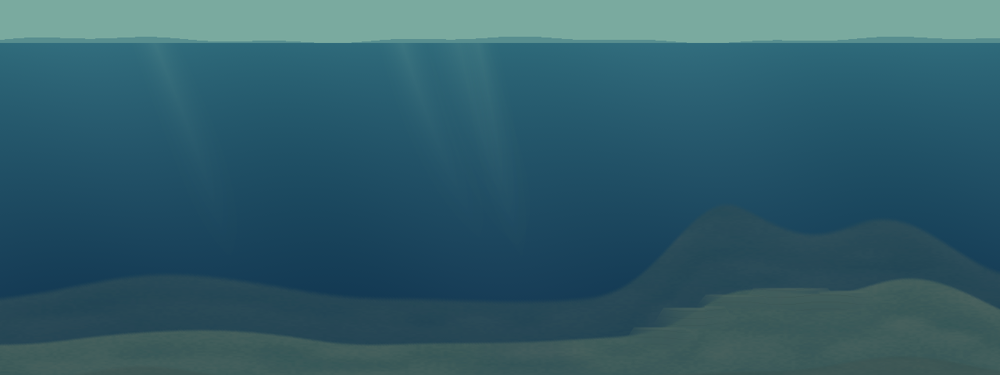

# WG-6.1：水下地势独立预览

首轮完成 WG-6.0 基线核对和 WG-6.1 地势预览，阶段状态为 **WAITING_FOR_REVIEW**。正式试玩继续使用 0.25.6；本轮没有接入对局，也没有新增生态植物或动物。

[四套构图与五镜头对照画廊](../../artifacts/watergen/wg6-final-01/gallery.html) · [验证报告](WG6_REPORT.md) · [开发基线](WG6_BASELINE.md) · [人工反馈](WG6_PLAYTEST_FEEDBACK.md)

画廊是本机原生捕获产物，不纳入 Git；从其他设备拉取源码后，可用下方验证命令重新生成。代表图随报告提交。

| 构图 | 种子 | 首轮地势方向 |
|---|---:|---|
| 蕨叶庭 | 713284 | 两侧浅丘、中央沉积沟，缓坡过渡 |
| 长叶湾 | 2649 | 左侧高坡，向中央和右侧展开 |
| 浮叶荫 | 42 | 低起伏、较宽的沉积低洼 |
| 垂根岸 | 731 | 右侧高岸，叠放石质台面 |

## 启动与对照

Windows PowerShell：

```powershell
& 'E:\Fish_catches_people\aquatic_system\BaitbreakPixel-watergen\tools\watergen\Open-Terrain-Preview.ps1'
```

默认使用现有 Godot 4.7.2 和 `D:\python\python.exe`，无需安装依赖。启动器支持 `-Godot` 指定引擎路径；`-Legacy` 可从原版环境启动，此时不准备 WG-6 地势和 WG-5 材质。

- `[` / `]`：切换四种构图，默认蕨叶庭 713284。
- `Tab`：完整地势环境 → 只看地势 → 现有生成水域 → Legacy 原版。
- `1`～`5`：左上、中心、右下、左下、右上；方向键平移。
- `空格`：播放或暂停现有植被；`R` 回到视觉时间零。
- `F`：现有独立预览的鱼、食物、细线和 QTE 静态样本。它们沿用旧预览样本，不代表 0.25.6 实战验证。
- `Esc`：退出。

完整环境与“现有生成水域”使用相同的 WG-5 木石、草叶材质参考和既有植被。Legacy 使用原版素材。静态交互草固定在时间零姿态；动态装饰草沿用原图集。预览不实例化比赛、玩家档案、NPC AI 或网络。

## 看图重点

先在“只看地势”里观察四种大构图，再和完整环境对照：浅丘、沟底是否自然，岸坡和石台是否容易被误认成会挡鱼或挡抄网的墙。地势仅为绘制描述，真实鱼可游区、碰撞、缠线目标与饵位保持原样。

这次的地势位于远景植被后方和既有木石下方，中央保持较低起伏。近侧低丘也烘焙在演员后方的床面层，不建立新的遮挡鱼、鱼线或巢穴提示的前景层。

蕨叶庭整世界：



垂根岸地势单独显示：



## 重跑验证和样片

```powershell
& 'D:\python\python.exe' -X utf8 'E:\Fish_catches_people\aquatic_system\BaitbreakPixel-watergen\tools\watergen\run_wg6.py' --godot 'E:\chrome下载\Godot_v4.7.2-stable_win64.exe\Godot_v4.7.2-stable_win64_console.exe'
```

默认运行地势契约和原生捕获，写入新的 `artifacts/watergen/wg6-<时间>-<随机后缀>`。已有目录拒绝覆盖；进程有超时，用户目录隔离，检查引擎错误、完成标记及运行期间源码稳定性。`--mode headless` 只检查契约，`--mode native` 只捕获，`--mode preview` 是交互预览。

每套输出完整环境、terrain-only、现有生成水域和 Legacy 四种模式；每模式包含整世界与五镜头，即 96 张图，另有一张静态可读性样本。`terrain-plan.json` 为纯值地势，`run-manifest.json` 和 `wg6-native-evidence.json` 记录源码、命令、结果、设备与耗时。

按开发规格第 21 节，地势方向确认后才进入 WG-6.2 植物群落。WG-5 人工材质确认仍单独保留，自动检查不替代人工评价。
